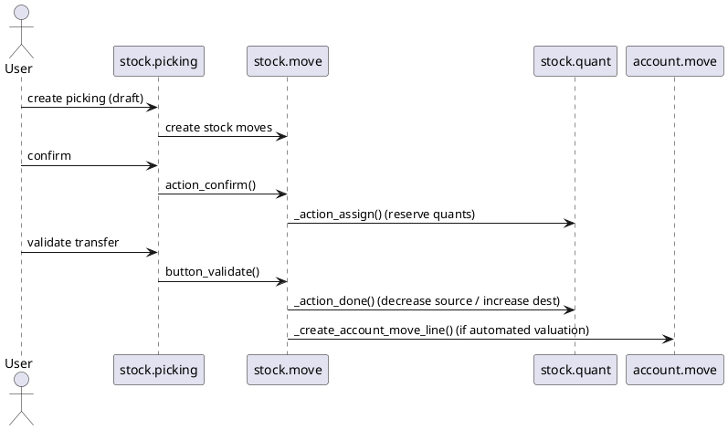

# Inventory Core Flow (Odoo 18)

> **Scope:** Describes the stock management engine supplied by `stock` and `stock_account`. It covers stock moves/pickings, valuation, reservations, and integration with Sales, Purchase, and Manufacturing flows.

## 1. Principal models

| Model | File | Responsibilities |
|-------|------|------------------|
| `stock.picking` | `addons/stock/models/stock_picking.py` | High-level document grouping stock moves (receipts, deliveries, internal transfers). Drives workflow states (`draft`, `confirmed`, `assigned`, `done`). |
| `stock.move` | `addons/stock/models/stock_move.py` | Represents a movement of quantity between locations. Handles reservation, procurement, move lines. |
| `stock.move.line` | `addons/stock/models/stock_move_line.py` | Detailed operations (lot/serial, package, owner). |
| `stock.quant` | `addons/stock/models/stock_quant.py` | On-hand stock per location/lot; manages reservation and valuation (with `stock_account`). |
| `stock.location` | `addons/stock/models/stock_location.py` | Warehouse structure (internal, customer, vendor, production, virtual). |
| `procurement.group` / `procurement.rule` | `addons/stock/models/procurement.py` | Determine how demand is fulfilled (manufacture, buy, pull/push). |
| `stock.backorder.confirmation` (wizard) | `addons/stock/wizard/stock_backorder_confirmation.py` | Handles backorders when picking partially processed. |

## 2. Warehouse structure

- Warehouse (`stock.warehouse`) defines input/output/internal locations, routes, and picking types.
- Picking types (receipts, deliveries, internal transfers) configure behavior (reservations, set of move types) and tie to `stock.picking`.
- Locations form a tree; special usage types: `internal`, `customer`, `supplier`, `inventory`, `production`, `transit`.

## 3. Move lifecycle

### Key methods
- `stock.picking.action_confirm()` – sets moves to `confirmed`, creates procurement if needed.
- `stock.move._action_assign()` – reserves quants; uses `stock.quant` to check availability; may create move lines.
- `stock.picking.button_validate()` – orchestrates checks (pack operations, immediate transfer wizard). Calls `_action_done()` on move lines.
- `stock.move._action_done()` – finalises move, updates quants, writes done quantities, triggers valuation.
- `stock.quant._update_available_quantity()` – adjusts quantities; ensures no negative stock unless allowed.

## 4. Valuation & accounting (see also `[[Odoo 18/Core/Processes/Accounting/Index]]`)
- Determined by product category (`inventory_valuation`, `costing_method`).
- **Automated valuation** (perpetual) uses `stock_account` to create `account.move` entries via `_create_account_move_line()`; uses stock interim accounts.
- **Periodic valuation** (manual) relies on inventory adjustments.
- Costing methods: `standard`, `fifo`, `average`. FIFO uses `stock.move` layers.

## 5. Reservations & availability
- Scheduler (`stock.scheduler.compute`) evaluates procurements; unreserved moves may trigger procurement rules (buy/MTO/MTS).
- `stock.move._should_bypass_reservation()` allows bypass (dropship, consignment).
- Batch picking/cluster picking modules extend reservations for wave picking.

## 6. Inventory adjustments
- `stock.inventory` (in v18 replaced by inventory adjustments on locations) uses `stock.quant` count mode.
- Express via operations: `action_set_quantities_to_zero`, `action_view_inventory…`.
- Negative quants require enabling `allow_negative_stock` on locations.

## 7. Cross-module integration
| Flow | Integration |
|------|-------------|
| Sales | `sale_stock` adjusts delivered quantities and creates pickings from `sale.order` lines; see `[[Odoo 18/Core/Processes/Sales/Index]]`. |
| Purchase | `purchase_stock` generates incoming shipments; vendor bills triggered from receipt. |
| Manufacturing (`mrp`) | Uses stock moves to consume components/produce finished goods; see enterprise manufacturing notes. |
| Accounting | `stock_account` posts valuation entries; integrates with `res.company` fiscal settings. |
| Enterprise features | Wave picking, barcode, quality checks extend workflow (`stock_barcode`, `quality_control`). |

## 8. Configuration pointers
- Warehouse: `Inventory > Configuration > Warehouses`, enabling multi-step routes (one/two/three step operations).
- Routes: define push/pull rules; stored in `stock.rule`. MTO vs MTS controlled via product routes.
- Scrap/dispose: `stock.scrap` records move inventory to scrap locations.
- Lot/serial control: product tracking options, associated with `stock.production.lot`.

## 9. To-do (Issue #9)
- [ ] Document scheduler/procurement rule resolution with example route diagram.
- [ ] Add sample of valuation journal entry for FIFO vs Standard cost.
- [ ] Reference barcode/quality modules when their notes are ready.

## Navigation
- **Parent:** `[[Odoo 18/Core/Processes/Index]]`
- **Related:** `[[Odoo 18/Core/Processes/Accounting/Index]]`, `[[Odoo 18/Core/Processes/Sales/Index]]`, `[[Odoo 18/Core/Master Data/res_company.md]]`
- **Issue:** #9 `Docs: Odoo 18 Core Process - Inventory`
