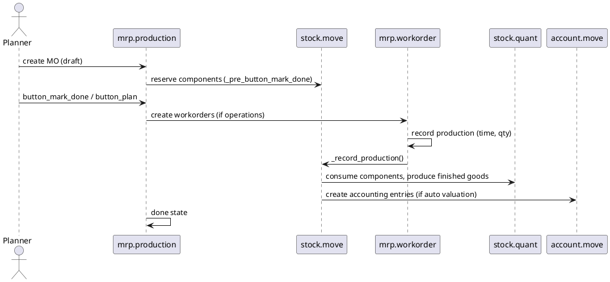

# Manufacturing Core Flow (Odoo 18)

> **Scope:** Projects the core features of the Manufacturing module (`mrp`). While some advanced capabilities live in Enterprise, Community still provides multi-level BOMs, work orders (basic), and integration with stock and accounting.

## 1. Principal models

| Model | File | Responsibilities |
|-------|------|------------------|
| `mrp.bom` | `addons/mrp/models/mrp_bom.py` | Defines Bill of Materials (components, by-products, operations). |
| `mrp.production` | `addons/mrp/models/mrp_production.py` | Manufacturing Order (MO); controls reservation, consumption, and production of goods. |
| `mrp.workorder` | `addons/mrp/models/mrp_workorder.py` | Work orders tied to operations (more extensive in Enterprise). |
| `stock.move` | `addons/stock/models/stock_move.py` | Used for component consumption and finished product production; integrates with inventory valuation. |
| `mrp.unbuild` | `addons/mrp/models/mrp_unbuild.py` | Reverse manufacturing (unbuild orders). |

## 2. Manufacturing lifecycle

### Key steps
- **Creation**: MOs generated manually, via reordering rules (`_generate_mo`), or sales with manufacturing routes.
- **Planning**: `_action_confirm()` reserves components using stock reservation logic; creates work orders based on BoM operations.
- **Work orders**: For simple operations, community uses manual `qty_produced`; advanced tablets/time tracking require Enterprise.
- **Completion**: `button_mark_done()` validates component consumption and finished product moves; triggers valuation and backorder if partial.

## 3. Bill of Materials specifics
- Multiple BoM types: manufacturing vs kit; kit BoMs exploded on sales order lines (no MO).
- BoM lines support alternative components, by-products; `operation_id` links to work order.
- Validity dates and company allow multi-company BoMs.

## 4. Integrations
- **Inventory**: Moves rely on `stock` routes; location usage (`production`) influences valuation. See `[[Odoo 18/Core/Processes/Inventory]]`.
- **Accounting**: `mrp_account_enterprise` (Enterprise) provides WIP accounts; community relies on stock valuation.
- **Quality & Maintenance**: Enterprise modules extend `mrp.workorder` with quality checkpoints (`quality_control`) and equipment maintenance (`maintenance`).
- **Planning / Forecasting**: `mrp_plm`, `mrp_forecast` etc. require Enterprise; note pending to reference when available.
- **Costing**: `standard`, `fifo`, `average` cost methods impact BoM cost computation (`_bom_explode`).

## 5. Configuration
- Settings: Work orders, lot/serial tracking, unbuild orders, subcontracting (Enterprise) toggled via `res.config.settings`.
- BoM structure accessible via form views; operations require work centers (Enterprise feature).
- Scrap management uses `stock.scrap` integrated with production orders.

## 6. To-do (Issue #13)
- [ ] Add example of replenishment route (MTO) generating MO from sale order.
- [ ] Document quality/maintenance hooks when those notes exist.
- [ ] Provide cost roll-up example referencing BoM cost method.

## Navigation
- **Parent:** `[[Odoo 18/Core/Processes]]`
- **Related:** `[[Odoo 18/Core/Processes/Inventory]]`, `[[Odoo 18/Core/Processes/Accounting]]`, `[[Odoo 18/Enterprise Addons/Manufacturing]]`
- **Issue:** #13 `Docs: Odoo 18 Core Process - Manufacturing`

## Children
- (none)