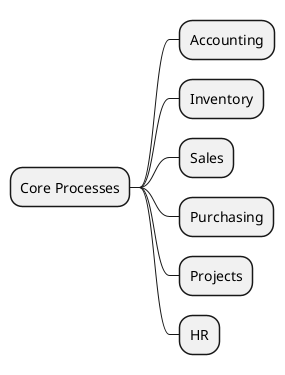

# Core Processes v18

## Core flows
- Accounting (`account`) -> `[[Odoo 18/Core/Processes/Accounting]]`
- Inventory (`stock`) -> `[[Odoo 18/Core/Processes/Inventory]]`
- Sales (`sale_management`) -> `[[Odoo 18/Core/Processes/Sales]]`
- Purchasing (`purchase`) -> `[[Odoo 18/Core/Processes/Purchasing]]`
- Projects (`project`) -> `[[Odoo 18/Core/Processes/Projects]]`
- HR (`hr`) -> `[[Odoo 18/Core/Processes/HR]]`

## Aim
- Document end-to-end flows with triggers, validations, and outputs.
- Integrate state and sequence diagrams.
- Highlight hooks for customizations.

## Navigation
- **Parent:** [[Odoo 18/Core]]

## Children
- [[Odoo 18/Core/Processes/Accounting]]
- [[Odoo 18/Core/Processes/HR]]
- [[Odoo 18/Core/Processes/Inventory]]
- [[Odoo 18/Core/Processes/Manufacturing]]
- [[Odoo 18/Core/Processes/Projects]]
- [[Odoo 18/Core/Processes/Purchasing]]
- [[Odoo 18/Core/Processes/Sales]]