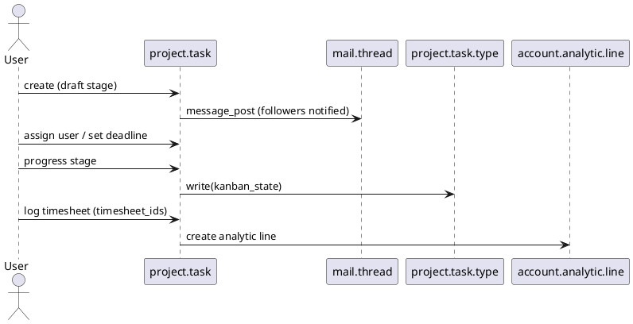

# Projects Core Flow (Odoo 18)

> **Scope:** Documents the project/task lifecycle in Community edition (`project` module). Covers project creation, task management, timesheet integration, and links to Sales/Services modules.

## 1. Principal models

| Model | File | Responsibilities |
|-------|------|------------------|
| `project.project` | `addons/project/models/project.py` | Represents a project; manages stages, privacy (visibility), tasks, analytic account, portal sharing. |
| `project.task` | `addons/project/models/project.py` | Work items with stages (`kanban_state`), `user_id`, timesheets, sub-tasks, dependencies. |
| `project.task.type` | `addons/project/models/project.py` | Kanban stages per project. |
| `project.task.calendar.event` | `addons/project/models/project_task_calendar.py` | Links tasks to calendar events. |
| Wizards (`project.task.create.timesheet`, etc.) | various | Generate timesheets or convert issues to tasks. |

## 2. Project types & privacy
- `privacy_visibility`: `portal`, `employees`, `followers`  controls who can access tasks.
- Projects may have `allow_timesheets`, `allow_billable`, `allow_subtasks` toggles.
- `analytic_account_id` automatically created (if optional apps installed) to collect timesheet costs (see `account.analytic.account`).

## 3. Task lifecycle

### Key methods
- `create()`: ensures default stage, sets `sequence`, links to analytic account if needed.
- `write()`: handles stage change notifications, activity scheduling.
- `action_assign_to_me()`, `action_subtask_add()`, `action_view_timesheet()` provide UI actions.
- `_message_subscribe` extends mail followers when assigning users or customers.

## 4. Integration points
- **Sales**: `sale_project`, `sale_timesheet` generate projects/tasks from sale order lines (see `[[Odoo 18/Core/Processes/Sales]]`).
- **Helpdesk**: tasks can be created from tickets; modules like `project_helpdesk` link them.
- **Timesheets**: `project_timesheet` records timesheet entries (`account.analytic.line`) from tasks; used for billing (T&M) via `sale_timesheet`.
- **Invoicing**: analytic lines flagged billable feed into invoice generation (`sale_timesheet`).
- **Manufacturing** / `mrp_project`: tasks for maintenance or MO follow-up.

## 5. Stages & activities
- Stages maintain sequences and fold state; pipeline can be grouped by stage or user.
- Activities (`mail.activity`) scheduled for deadlines/follow-ups; automated reminders configurable.
- Kanban color coding via `color` field; label features highlight priority or tags.

## 6. Portal & collaboration
- Portal users see tasks when they are followers and project is `portal` or `followers` visibility.
- Sharing via `res.partner` invites (mail templates) and `project.mail.activity` notifications.
- Documents app (Enterprise) extends with file management but basic chatter attachments available in CE.

## 7. Configuration references
- Settings (`res.config.settings`) toggle sub-tasks, recurring tasks, timesheets, `milestones` (via `project_mrp` etc.).
- Templates: `project.project.template` to create preset structures (module `project_template`).
- Security: groups `project.group_project_manager`, `project.group_project_user`. Link to `[[Odoo 18/Core/Master Data/res_users.md]]` for group analysis.

## 8. To-do (Issue #11)
- [ ] Document analytics (timesheet) integration in detail with cost/profit reporting.
- [ ] Add example of project creation from sale order line.
- [ ] Reference QA/maintenance modules once documented.

## Navigation
- **Parent:** [[Odoo 18/Core/Processes/Processes]]
## Children
- (none)
