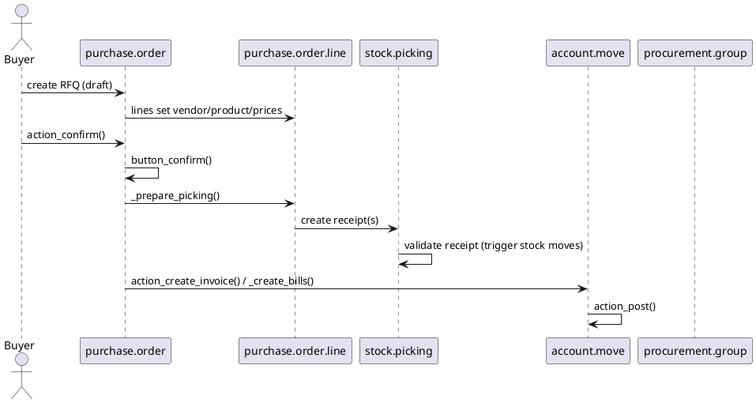

# Purchasing Core Flow (Odoo 18)

> **Scope:** Describes the purchase order lifecycle delivered by the `purchase` module (Community). It covers RFQ creation, confirmation, receipts, vendor bills, and procurement integration.

## 1. Principal models

| Model | File | Responsibilities |
|-------|------|------------------|
| `purchase.order` | `addons/purchase/models/purchase.py` | RFQ and Purchase Orders; manages states (`draft`, `sent`, `to approve`, `purchase`, `done`, `cancel`). Connects to procurement, stock, accounting. |
| `purchase.order.line` | `addons/purchase/models/purchase.py` | Order lines with product, quantity, schedule, analytic distribution. Launches procurements/stock moves when confirmed. |
| `purchase.requisition` (optional) | `addons/purchase_requisition/models/purchase_requisition.py` | Call for tender (Enterprise). For CE, highlight optional module. |
| Wizards: `purchase.order.cancel`, `purchase.advance.payment.inv`, etc. | Various | Cancel approvals, down payments (with `account`), etc. |

## 2. Lifecycle overview

### Confirmation
- `button_confirm()` switches to `purchase` stage, creates procurements/stock pickings (`_create_picking`).
- Approval rules (depends on module) may require manager approval (`group_purchase_manager`, `purchase_approval`).
- Vendor warnings (`purchase_warn` on partner) handled before confirmation.

### Receipt
- Generated picking type (incoming) per warehouse; uses `stock.picking` and `stock.move` to receive goods.
- Partial receipts create backorders using `stock.backorder.confirmation`.
- Delivered quantities update `qty_received` on purchase lines (via stock moves or manual update for services).

### Billing
- Vendor bills created via `action_create_invoice` (calls `_get_invoice_values` to prepare `account.move`).
- Bill control policy in settings: `ordered quantities` vs `received quantities`.
- Integration with `account` for posting, payments, and price difference accounts.

## 3. Pricing, taxes & analytic
- Pricelists for vendors via `product.supplierinfo` using lead time, minimum quantity.
- Taxes from vendor/product, remapped by fiscal positions. Landed costs handled in `stock_landed_costs` (Enterprise).
- Analytic distribution on lines (`analytic_distribution`) flows into vendor bills.

## 4. Procurement integration
- Purchase is one fulfilment method for procurement rules. `stock.rule` with action `buy` generates purchase orders via `_run_buy()`.
- Reordering rules (`stock.warehouse.orderpoint`) create procurements that land on RFQs.
- Dropshipping handled via routes; lines flagged `is_drop_ship` create pickings from supplier to customer.

## 5. Extensions & Hooks
- **Approvals:** `purchase_order_approval` adds multi-step approval; enterprises features add budgets.
- **Call for tenders:** `purchase_requisition` orchestrates multiple quotations and order awarding.
- **Vendor evaluation:** integrations with `maintenance`, `quality` add checks. Attachments via `mail.thread`.
- **Portal:** `purchase_portal` lets vendors acknowledge orders.

## 6. Configuration references
- Settings via `res.config.settings` (order approval minimum, double validation, bill control policy).
- Default journals/accounts via `ir.property` (document in shared note). Example fields: `property_account_payable_id` for vendors.
- Incoterms, shipping addresses, lead times configured on partners/products.

## 7. Cross-links
- `[[Odoo 18/Core/Processes/Inventory]]`  receipts & stock valuation.
- `[[Odoo 18/Core/Processes/Accounting]]`  vendor bills & payments.
- `[[Odoo 18/Core/Master Data/res_partner.md]]`  vendor warnings, payment terms.
- `[[Odoo 18/Community Addons/Inventory]]`  drop-shipping, cross-docks.

## 8. To-do (Issue #10)
- [ ] Document approval rules & double validation thresholds.
- [ ] Add example of procurement rule generating a purchase order.
- [ ] Cover landed cost flows when `stock_landed_costs` note exists.

## Navigation
- **Parent:** [[Odoo 18/Core/Processes/Processes]]
## Children
- (none)
