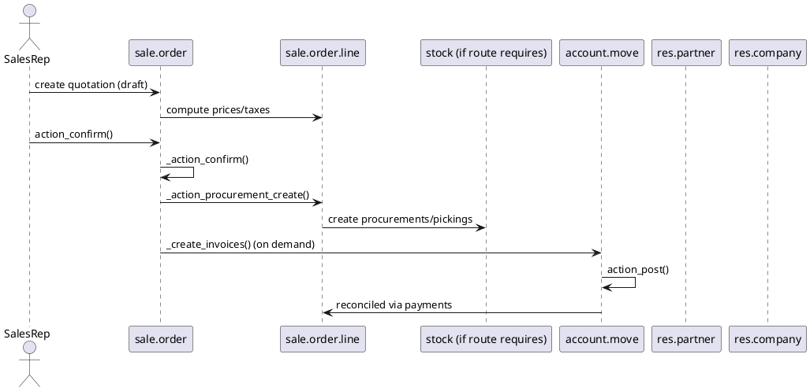

# Sales Core Flow (Odoo 18)

> **Scope:** Documents the standard sales cycle provided by `sale_management` and its dependencies (pricing, delivery, invoicing). It focuses on the end-to-end flow: quotation ? confirmation ? delivery ? invoicing ? payment, and the hooks that enable extensions (subscriptions, projects, inventory).

## 1. Principal models

| Model | File | Responsibilities |
|-------|------|------------------|
| `sale.order` | `addons/sale/models/sale_order.py` | Master record for quotations/orders. Manages states (`draft`, `sale`, `done`, `cancel`), pricing, fiscal positions, and downstream operations. |
| `sale.order.line` | `addons/sale/models/sale_order.py` | Order lines with product, quantity, price, taxes; responsible for procurement_group creation and linking to stock moves/project tasks. |
| `sale.order.template` | `addons/sale/models/sale_order_template.py` | Quotation templates and default options. |
| Wizards (`sale.advance.payment.inv`, `sale.order.cancel`, `sale.order.option`) | Various | Generate invoices, apply down payments, manage optional products. |

**Key mixins:** `mail.thread`, `mail.activity.mixin` for chatter; `utm.mixin` for marketing tracking.

## 2. Lifecycle overview

### Confirmation (`action_confirm`)
- Validates partner credit limit, warning policies (`sale_warn` from partner).
- Calls `_action_confirm()` which:
  - Sets `state = 'sale'`.
  - Creates procurement group (`procurement.group`) and pushes lines to stock rules when products are stockable (`_action_launch_procurement_rule`).
  - Triggers project/task creation for service products with `service_tracking` settings (projects/tickets).
  - Sends confirmation email via `sale.email_template_edi_sale` (if enabled).

### Delivery
- `stock_picking` records create moves from order lines. Dependencies documented in `[[Odoo 18/Community Addons/Inventory]]`.
- On delivery completion, delivered quantities update `qty_delivered` using delivery methods (stock moves, manually set, tasks, timesheets).

### Invoicing
- Invoicing policies (`order`, `delivery`) run through `_create_invoices()`:
  - Draft invoices created (`account.move` of type `out_invoice`).
  - Down payments handled by wizard `sale.advance.payment.inv` generating service lines or invoice lines via deposit products.
  - `invoice_status` field tracks `no`, `to invoice`, `invoiced`.
- Invoices posted and reconciled with payments (see accounting notes).

## 3. Pricing & taxes
- Pricelists (`product.pricelist`) applied via `_get_pricelist`; items stored in `product.pricelist.item` with rules by product/category.
- Discounts: standard field `discount` on lines; for advanced promotions, `sale_coupon` module extends flow.
- Fiscal positions (`account.fiscal.position`) auto-applied via partner/company configuration; remap taxes/accounts on confirmation.

## 4. Extensions & Hooks

### Inventory integration
- Stockable products: `route_ids`, `procure_method`, and `warehouse_id` determine pickings.
- Drop-shipping/Make-to-order rely on procurement rules; `sale_stock` module adds `_action_launch_stock_rule` logic.
- Delivered quantities update based on completed pickings (`_compute_qty_delivered`)  use move lines or manual for services.

### Services / Projects
- Products with `service_tracking` create tasks or projects (`sale_project`, `sale_timesheet`). `_create_project` and `_timesheet_service_generation` handle that flow.
- Revenue recognition: timesheets feed `qty_delivered_method = timesheet`, integrated with `project_timesheet` & `account`.

### Subscriptions & Recurring
- `sale_subscription` overrides `_create_recurring_invoice` and extends order lines with recurring options.

### Portal & Signatures
- `website_sale` displays orders on the website; portal module allows customers to accept/reject quotations, triggering `action_confirm` or `action_cancel`.
- `sale_sign` allows digital signatures through `sale.order.onchange_signature` etc.

## 5. Automation & Activities
- Activities automatically scheduled on confirmation (follow-ups) configurable via `res.config.settings`.
- Cron `sale.order.invoice.create` (if enabled) can auto-create invoices for delivered orders.
- Reminder emails / expiration handled by `sale_order_template`. `validity_date` set via template or default configuration.

## 6. Related settings & data
- `res.config.settings` toggles features (discounts, pro-forma, incoterms, shipping address validation).
- Default journals/products for down payments stored via `ir.property` (to document in shared note). See `sale_default_deposit_product_id`.
- Security: groups like `sales_team.group_sale_manager`, `group_sale_user`, `group_sale_salesman_all_leads` control access. Reference `res.groups` descriptions in `[[Odoo 18/Core/Master Data/res_users.md]]`.

## 7. Cross-links
- **Inventory**: `[[Odoo 18/Community Addons/Inventory]]` for stock pickings, routes.
- **Accounting**: `[[Odoo 18/Core/Processes/Accounting]]` for invoicing/posting.
- **Projects**: `[[Odoo 18/Community Addons/Services]]` for service delivery.
- **res.partner** warnings: `sale_warn`, `invoice_warn` fields described in `[[Odoo 18/Core/Master Data/res_partner.md]]`.

## 8. To-do (Issue #7)
- [ ] Detail how quotation templates inject optional products/options.
- [ ] Document `sale_coupon`, `sale_promotion` modules once notes exist.
- [ ] Add example JSON for `sale.order` creation via RPC + response flow.

## Navigation
- **Parent:** `[[Odoo 18/Core/Processes]]`
- **Related:** `[[Odoo 18/Core/Processes/Accounting]]`, `[[Odoo 18/Community Addons/Inventory]]`, `[[Odoo 18/Core/Master Data/res_partner.md]]`
- **Issue:** #7 `Docs: Odoo 18 Core Process - Sales`

## Children
- (none)