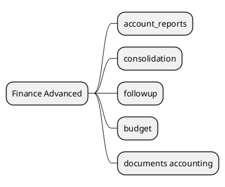

# AdvancedFinance v18

## Modules
- `[[Odoo 18/Enterprise Addons/Advanced Finance/account_reports.md]]`
- `[[Odoo 18/Enterprise Addons/Advanced Finance/account_consolidation.md]]`
- `[[Odoo 18/Enterprise Addons/Advanced Finance/account_followup.md]]`
- `[[Odoo 18/Enterprise Addons/Advanced Finance/account_budget.md]]`
- `[[Odoo 18/Enterprise Addons/Advanced Finance/documents_accounting.md]]`

## Actions
- Document dynamic reports and financial dashboards.
- Analyze multi-company consolidation.
- Map collection automations.

## Navigation
- **Parent:** [[Odoo 18/Enterprise Addons/Enterprise Addons]]
## Children
- [[Odoo 18/Enterprise Addons/Advanced Finance/account_budget]]
- [[Odoo 18/Enterprise Addons/Advanced Finance/account_consolidation]]
- [[Odoo 18/Enterprise Addons/Advanced Finance/account_followup]]
- [[Odoo 18/Enterprise Addons/Advanced Finance/account_reports]]
- [[Odoo 18/Enterprise Addons/Advanced Finance/documents_accounting]]
