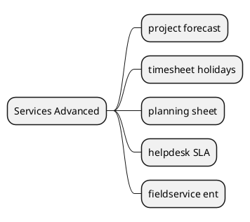

# Advanced Services v18

## Modules
- `[[Odoo 18/Enterprise Addons/Advanced Services/project_forecast.md]]`
- `[[Odoo 18/Enterprise Addons/Advanced Services/project_timesheet_holidays.md]]`
- `[[Odoo 18/Enterprise Addons/Advanced Services/planning_sheet.md]]`
- `[[Odoo 18/Enterprise Addons/Advanced Services/helpdesk_sla.md]]`
- `[[Odoo 18/Enterprise Addons/Advanced Services/fieldservice_enterprise.md]]`

## Actions
- Document advanced resource planning.
- Detail SLA and premium support flows.
- Integrate with sales and finance modules.

## Navigation
- **Parent:** [[Odoo 18/Enterprise Addons]]

## Children
- [[Odoo 18/Enterprise Addons/Advanced Services/fieldservice_enterprise]]
- [[Odoo 18/Enterprise Addons/Advanced Services/helpdesk_sla]]
- [[Odoo 18/Enterprise Addons/Advanced Services/planning_sheet]]
- [[Odoo 18/Enterprise Addons/Advanced Services/project_forecast]]
- [[Odoo 18/Enterprise Addons/Advanced Services/project_timesheet_holidays]]