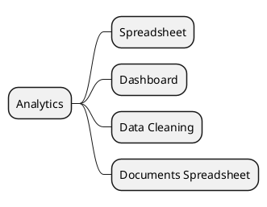

# Analytics & BI v18

## Modules
- `[[Odoo 18/Enterprise Addons/Analytics/spreadsheet_enterprise.md]]`
- `[[Odoo 18/Enterprise Addons/Analytics/dashboard_enterprise.md]]`
- `[[Odoo 18/Enterprise Addons/Analytics/data_cleaning.md]]`
- `[[Odoo 18/Enterprise Addons/Analytics/documents_spreadsheet.md]]`

## Actions
- Document use cases for smart spreadsheets.
- Map integration with accounting and sales data.
- Identify cleaning and enrichment tools.

## Navigation
- **Parent:** [[Odoo 18/Enterprise Addons/Enterprise Addons]]
## Children
- [[Odoo 18/Enterprise Addons/Analytics/dashboard_enterprise]]
- [[Odoo 18/Enterprise Addons/Analytics/data_cleaning]]
- [[Odoo 18/Enterprise Addons/Analytics/documents_spreadsheet]]
- [[Odoo 18/Enterprise Addons/Analytics/spreadsheet_enterprise]]
