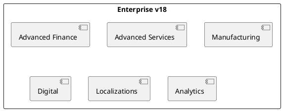

# Odoo 18 Enterprise Addons

## Enterprise portfolio
- Advanced Finance -> `[[Odoo 18/Enterprise Addons/Advanced Finance]]`
- Projects & Premium Services -> `[[Odoo 18/Enterprise Addons/Advanced Services]]`
- Factory & MRPs -> `[[Odoo 18/Enterprise Addons/Manufacturing]]`
- Digital experience -> `[[Odoo 18/Enterprise Addons/Digital]]`
- Localizations and taxation -> `[[Odoo 18/Enterprise Addons/Localizations]]`
- Analytics & BI -> `[[Odoo 18/Enterprise Addons/Analytics]]`

## Initial documentation focus
- Identify improvements over Community and document overlaps.
- Highlight licensing and activation requirements.
- Locate modules with recurring customizations for clients.

## References
- `[[Odoo 18]]`
- `[[Comparisons]]`
- `[[Licensing/Enterprise Guide]]`

## Navigation
- **Parent**: [[Odoo 18]]`n- **Children**:
  - [[Odoo 18/Enterprise Addons/Advanced Finance]]`n  - [[Odoo 18/Enterprise Addons/Advanced Services]]`n  - [[Odoo 18/Enterprise Addons/Manufacturing]]`n  - [[Odoo 18/Enterprise Addons/Digital]]`n  - [[Odoo 18/Enterprise Addons/Localizations]]`n  - [[Odoo 18/Enterprise Addons/Analytics]]`n

## Children
- [[Odoo 18/Enterprise Addons/Advanced Finance]]
- [[Odoo 18/Enterprise Addons/Advanced Services]]
- [[Odoo 18/Enterprise Addons/Analytics]]
- [[Odoo 18/Enterprise Addons/Digital]]
- [[Odoo 18/Enterprise Addons/Localizations]]
- [[Odoo 18/Enterprise Addons/Manufacturing]]