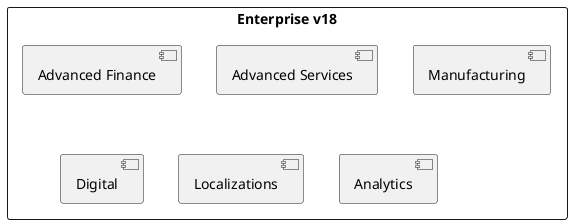

# Odoo 18 Enterprise Addons

## Enterprise portfolio
- Advanced Finance -> `[[Odoo 18/Enterprise Addons/Advanced Finance/Index]]`
- Projects & Premium Services -> `[[Odoo 18/Enterprise Addons/Advanced Services/Index]]`
- Factory & MRPs -> `[[Odoo 18/Enterprise Addons/Manufacturing/Index]]`
- Digital experience -> `[[Odoo 18/Enterprise Addons/Digital/Index]]`
- Localizations and taxation -> `[[Odoo 18/Enterprise Addons/Localizations/Index]]`
- Analytics & BI -> `[[Odoo 18/Enterprise Addons/Analytics/Index]]`

## Initial documentation focus
- Identify improvements over Community and document overlaps.
- Highlight licensing and activation requirements.
- Locate modules with recurring customizations for clients.

## References
- `[[Odoo 18/Index]]`
- `[[Comparisons/Index]]`
- `[[Licensing/Enterprise Guide]]`

## Navigation
- **Parent**: [[Odoo 18/Index]]`n- **Children**:
  - [[Odoo 18/Enterprise Addons/Advanced Finance/Index]]`n  - [[Odoo 18/Enterprise Addons/Advanced Services/Index]]`n  - [[Odoo 18/Enterprise Addons/Manufacturing/Index]]`n  - [[Odoo 18/Enterprise Addons/Digital/Index]]`n  - [[Odoo 18/Enterprise Addons/Localizations/Index]]`n  - [[Odoo 18/Enterprise Addons/Analytics/Index]]`n

## Children
- [[Odoo 18/Enterprise Addons/Advanced Finance/Index]]
- [[Odoo 18/Enterprise Addons/Advanced Services/Index]]
- [[Odoo 18/Enterprise Addons/Analytics/Index]]
- [[Odoo 18/Enterprise Addons/Digital/Index]]
- [[Odoo 18/Enterprise Addons/Localizations/Index]]
- [[Odoo 18/Enterprise Addons/Manufacturing/Index]]