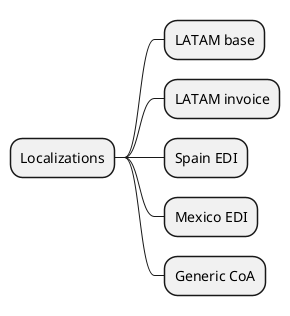

# Locations & Taxation v18

## Modules
- `[[Odoo 18/Enterprise Addons/Localizations/l10n_latam_base.md]]`
- `[[Odoo 18/Enterprise Addons/Localizations/l10n_latam_invoice.md]]`
- `[[Odoo 18/Enterprise Addons/Localizations/l10n_es_edi.md]]`
- `[[Odoo 18/Enterprise Addons/Localizations/l10n_mx_edi.md]]`
- `[[Odoo 18/Enterprise Addons/Localizations/l10n_generic_coa.md]]`

## Actions
- Catalog supported locations.
- Document legal and electronic requirements.
- Map differences vs community/external locations.

## Navigation
- **Parent:** [[Odoo 18/Enterprise Addons/Enterprise Addons]]
## Children
- [[Odoo 18/Enterprise Addons/Localizations/l10n_es_edi]]
- [[Odoo 18/Enterprise Addons/Localizations/l10n_generic_coa]]
- [[Odoo 18/Enterprise Addons/Localizations/l10n_latam_base]]
- [[Odoo 18/Enterprise Addons/Localizations/l10n_latam_invoice]]
- [[Odoo 18/Enterprise Addons/Localizations/l10n_mx_edi]]
