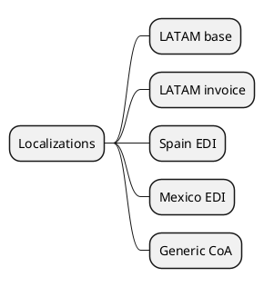

# Locations & Taxation v18

## Modules
- `[[Odoo 18/Enterprise Addons/Localizations/l10n_latam_base.md]]`
- `[[Odoo 18/Enterprise Addons/Localizations/l10n_latam_invoice.md]]`
- `[[Odoo 18/Enterprise Addons/Localizations/l10n_es_edi.md]]`
- `[[Odoo 18/Enterprise Addons/Localizations/l10n_mx_edi.md]]`
- `[[Odoo 18/Enterprise Addons/Localizations/l10n_generic_coa.md]]`

```plantuml
@startmindmap
* Localizations
** LATAM base
** LATAM invoice
** Spain EDI
** Mexico EDI
** Generic CoA
@endmindmap
```

## Actions
- Catalog supported locations.
- Document legal and electronic requirements.
- Map differences vs community/external locations.

## Navigation
- **Parent:** [[Odoo 18/Enterprise Addons/Enterprise Addons]]
## Children
- [[Odoo 18/Enterprise Addons/Localizations/l10n_es_edi]]
- [[Odoo 18/Enterprise Addons/Localizations/l10n_generic_coa]]
- [[Odoo 18/Enterprise Addons/Localizations/l10n_latam_base]]
- [[Odoo 18/Enterprise Addons/Localizations/l10n_latam_invoice]]
- [[Odoo 18/Enterprise Addons/Localizations/l10n_mx_edi]]
<!-- GENERATED:CATEGORY -->
---
tags: [odoo, v18, enterprise, index, category]
---

# Localizations

Modules: 259

- [[Odoo 18/Enterprise Addons/l10n_ae_corporate_tax_report/l10n_ae_corporate_tax_report|l10n_ae_corporate_tax_report]]
- [[Odoo 18/Enterprise Addons/l10n_ae_hr_payroll/l10n_ae_hr_payroll|l10n_ae_hr_payroll]]
- [[Odoo 18/Enterprise Addons/l10n_ae_hr_payroll_account/l10n_ae_hr_payroll_account|l10n_ae_hr_payroll_account]]
- [[Odoo 18/Enterprise Addons/l10n_ae_reports/l10n_ae_reports|l10n_ae_reports]]
- [[Odoo 18/Enterprise Addons/l10n_ar_edi/l10n_ar_edi|l10n_ar_edi]]
- [[Odoo 18/Enterprise Addons/l10n_ar_reports/l10n_ar_reports|l10n_ar_reports]]
- [[Odoo 18/Enterprise Addons/l10n_at_reports/l10n_at_reports|l10n_at_reports]]
- [[Odoo 18/Enterprise Addons/l10n_at_saft/l10n_at_saft|l10n_at_saft]]
- [[Odoo 18/Enterprise Addons/l10n_au_aba/l10n_au_aba|l10n_au_aba]]
- [[Odoo 18/Enterprise Addons/l10n_au_hr_payroll/l10n_au_hr_payroll|l10n_au_hr_payroll]]
- [[Odoo 18/Enterprise Addons/l10n_au_hr_payroll_account/l10n_au_hr_payroll_account|l10n_au_hr_payroll_account]]
- [[Odoo 18/Enterprise Addons/l10n_au_reports/l10n_au_reports|l10n_au_reports]]
- [[Odoo 18/Enterprise Addons/l10n_bd_hr_payroll/l10n_bd_hr_payroll|l10n_bd_hr_payroll]]
- [[Odoo 18/Enterprise Addons/l10n_bd_hr_payroll_account/l10n_bd_hr_payroll_account|l10n_bd_hr_payroll_account]]
- [[Odoo 18/Enterprise Addons/l10n_bd_reports/l10n_bd_reports|l10n_bd_reports]]
- [[Odoo 18/Enterprise Addons/l10n_be_account_disallowed_expenses_fleet/l10n_be_account_disallowed_expenses_fleet|l10n_be_account_disallowed_expenses_fleet]]
- [[Odoo 18/Enterprise Addons/l10n_be_coda/l10n_be_coda|l10n_be_coda]]
- [[Odoo 18/Enterprise Addons/l10n_be_codabox/l10n_be_codabox|l10n_be_codabox]]
- [[Odoo 18/Enterprise Addons/l10n_be_codaclean/l10n_be_codaclean|l10n_be_codaclean]]
- [[Odoo 18/Enterprise Addons/l10n_be_disallowed_expenses/l10n_be_disallowed_expenses|l10n_be_disallowed_expenses]]
- [[Odoo 18/Enterprise Addons/l10n_be_hr_contract_salary/l10n_be_hr_contract_salary|l10n_be_hr_contract_salary]]
- [[Odoo 18/Enterprise Addons/l10n_be_hr_contract_salary_mobility_budget/l10n_be_hr_contract_salary_mobility_budget|l10n_be_hr_contract_salary_mobility_budget]]
- [[Odoo 18/Enterprise Addons/l10n_be_hr_payroll/l10n_be_hr_payroll|l10n_be_hr_payroll]]
- [[Odoo 18/Enterprise Addons/l10n_be_hr_payroll_account/l10n_be_hr_payroll_account|l10n_be_hr_payroll_account]]
- [[Odoo 18/Enterprise Addons/l10n_be_hr_payroll_acerta/l10n_be_hr_payroll_acerta|l10n_be_hr_payroll_acerta]]
- [[Odoo 18/Enterprise Addons/l10n_be_hr_payroll_attendance/l10n_be_hr_payroll_attendance|l10n_be_hr_payroll_attendance]]
- [[Odoo 18/Enterprise Addons/l10n_be_hr_payroll_dimona/l10n_be_hr_payroll_dimona|l10n_be_hr_payroll_dimona]]
- [[Odoo 18/Enterprise Addons/l10n_be_hr_payroll_dmfa_sftp/l10n_be_hr_payroll_dmfa_sftp|l10n_be_hr_payroll_dmfa_sftp]]
- [[Odoo 18/Enterprise Addons/l10n_be_hr_payroll_fleet/l10n_be_hr_payroll_fleet|l10n_be_hr_payroll_fleet]]
- [[Odoo 18/Enterprise Addons/l10n_be_hr_payroll_group_s/l10n_be_hr_payroll_group_s|l10n_be_hr_payroll_group_s]]
- [[Odoo 18/Enterprise Addons/l10n_be_hr_payroll_partena/l10n_be_hr_payroll_partena|l10n_be_hr_payroll_partena]]
- [[Odoo 18/Enterprise Addons/l10n_be_hr_payroll_prisma/l10n_be_hr_payroll_prisma|l10n_be_hr_payroll_prisma]]
- [[Odoo 18/Enterprise Addons/l10n_be_hr_payroll_sd_worx/l10n_be_hr_payroll_sd_worx|l10n_be_hr_payroll_sd_worx]]
- [[Odoo 18/Enterprise Addons/l10n_be_hr_payroll_ucm/l10n_be_hr_payroll_ucm|l10n_be_hr_payroll_ucm]]
- [[Odoo 18/Enterprise Addons/l10n_be_intrastat/l10n_be_intrastat|l10n_be_intrastat]]
- [[Odoo 18/Enterprise Addons/l10n_be_intrastat_services/l10n_be_intrastat_services|l10n_be_intrastat_services]]
- [[Odoo 18/Enterprise Addons/l10n_be_reports/l10n_be_reports|l10n_be_reports]]
- [[Odoo 18/Enterprise Addons/l10n_be_reports_post_wizard/l10n_be_reports_post_wizard|l10n_be_reports_post_wizard]]
- [[Odoo 18/Enterprise Addons/l10n_be_reports_prorata/l10n_be_reports_prorata|l10n_be_reports_prorata]]
- [[Odoo 18/Enterprise Addons/l10n_be_reports_sms/l10n_be_reports_sms|l10n_be_reports_sms]]
- [[Odoo 18/Enterprise Addons/l10n_be_soda/l10n_be_soda|l10n_be_soda]]
- [[Odoo 18/Enterprise Addons/l10n_bg_reports/l10n_bg_reports|l10n_bg_reports]]
- [[Odoo 18/Enterprise Addons/l10n_bg_reports_ledger/l10n_bg_reports_ledger|l10n_bg_reports_ledger]]
- [[Odoo 18/Enterprise Addons/l10n_bo_reports/l10n_bo_reports|l10n_bo_reports]]
- [[Odoo 18/Enterprise Addons/l10n_br_avatax/l10n_br_avatax|l10n_br_avatax]]
- [[Odoo 18/Enterprise Addons/l10n_br_avatax_sale/l10n_br_avatax_sale|l10n_br_avatax_sale]]
- [[Odoo 18/Enterprise Addons/l10n_br_edi/l10n_br_edi|l10n_br_edi]]
- [[Odoo 18/Enterprise Addons/l10n_br_edi_pos/l10n_br_edi_pos|l10n_br_edi_pos]]
- [[Odoo 18/Enterprise Addons/l10n_br_edi_sale/l10n_br_edi_sale|l10n_br_edi_sale]]
- [[Odoo 18/Enterprise Addons/l10n_br_edi_stock/l10n_br_edi_stock|l10n_br_edi_stock]]
- [[Odoo 18/Enterprise Addons/l10n_br_edi_website_sale/l10n_br_edi_website_sale|l10n_br_edi_website_sale]]
- [[Odoo 18/Enterprise Addons/l10n_br_reports/l10n_br_reports|l10n_br_reports]]
- [[Odoo 18/Enterprise Addons/l10n_br_sale_subscription/l10n_br_sale_subscription|l10n_br_sale_subscription]]
- [[Odoo 18/Enterprise Addons/l10n_br_test_avatax_sale/l10n_br_test_avatax_sale|l10n_br_test_avatax_sale]]
- [[Odoo 18/Enterprise Addons/l10n_ca_check_printing/l10n_ca_check_printing|l10n_ca_check_printing]]
- [[Odoo 18/Enterprise Addons/l10n_ca_payment_cpa005/l10n_ca_payment_cpa005|l10n_ca_payment_cpa005]]
- [[Odoo 18/Enterprise Addons/l10n_ca_reports/l10n_ca_reports|l10n_ca_reports]]
- [[Odoo 18/Enterprise Addons/l10n_ch_hr_payroll/l10n_ch_hr_payroll|l10n_ch_hr_payroll]]
- [[Odoo 18/Enterprise Addons/l10n_ch_hr_payroll_account/l10n_ch_hr_payroll_account|l10n_ch_hr_payroll_account]]
- [[Odoo 18/Enterprise Addons/l10n_ch_hr_payroll_elm_transmission/l10n_ch_hr_payroll_elm_transmission|l10n_ch_hr_payroll_elm_transmission]]
- [[Odoo 18/Enterprise Addons/l10n_ch_hr_payroll_elm_transmission_account/l10n_ch_hr_payroll_elm_transmission_account|l10n_ch_hr_payroll_elm_transmission_account]]
- [[Odoo 18/Enterprise Addons/l10n_ch_reports/l10n_ch_reports|l10n_ch_reports]]
- [[Odoo 18/Enterprise Addons/l10n_cl_edi/l10n_cl_edi|l10n_cl_edi]]
- [[Odoo 18/Enterprise Addons/l10n_cl_edi_exports/l10n_cl_edi_exports|l10n_cl_edi_exports]]
- [[Odoo 18/Enterprise Addons/l10n_cl_edi_factoring/l10n_cl_edi_factoring|l10n_cl_edi_factoring]]
- [[Odoo 18/Enterprise Addons/l10n_cl_edi_pos/l10n_cl_edi_pos|l10n_cl_edi_pos]]
- [[Odoo 18/Enterprise Addons/l10n_cl_edi_stock/l10n_cl_edi_stock|l10n_cl_edi_stock]]
- [[Odoo 18/Enterprise Addons/l10n_cl_edi_website_sale/l10n_cl_edi_website_sale|l10n_cl_edi_website_sale]]
- [[Odoo 18/Enterprise Addons/l10n_cl_reports/l10n_cl_reports|l10n_cl_reports]]
- [[Odoo 18/Enterprise Addons/l10n_cn_reports/l10n_cn_reports|l10n_cn_reports]]
- [[Odoo 18/Enterprise Addons/l10n_co_dian/l10n_co_dian|l10n_co_dian]]
- [[Odoo 18/Enterprise Addons/l10n_co_edi/l10n_co_edi|l10n_co_edi]]
- [[Odoo 18/Enterprise Addons/l10n_co_edi_mandate/l10n_co_edi_mandate|l10n_co_edi_mandate]]
- [[Odoo 18/Enterprise Addons/l10n_co_edi_website_sale/l10n_co_edi_website_sale|l10n_co_edi_website_sale]]
- [[Odoo 18/Enterprise Addons/l10n_co_reports/l10n_co_reports|l10n_co_reports]]
- [[Odoo 18/Enterprise Addons/l10n_cy_reports/l10n_cy_reports|l10n_cy_reports]]
- [[Odoo 18/Enterprise Addons/l10n_cz_reports/l10n_cz_reports|l10n_cz_reports]]
- [[Odoo 18/Enterprise Addons/l10n_cz_reports_2025/l10n_cz_reports_2025|l10n_cz_reports_2025]]
- [[Odoo 18/Enterprise Addons/l10n_de_intrastat/l10n_de_intrastat|l10n_de_intrastat]]
- [[Odoo 18/Enterprise Addons/l10n_de_pos_cert/l10n_de_pos_cert|l10n_de_pos_cert]]
- [[Odoo 18/Enterprise Addons/l10n_de_pos_res_cert/l10n_de_pos_res_cert|l10n_de_pos_res_cert]]
- [[Odoo 18/Enterprise Addons/l10n_de_reports/l10n_de_reports|l10n_de_reports]]
- [[Odoo 18/Enterprise Addons/l10n_din5008_account_followup/l10n_din5008_account_followup|l10n_din5008_account_followup]]
- [[Odoo 18/Enterprise Addons/l10n_din5008_industry_fsm/l10n_din5008_industry_fsm|l10n_din5008_industry_fsm]]
- [[Odoo 18/Enterprise Addons/l10n_din5008_sale_renting/l10n_din5008_sale_renting|l10n_din5008_sale_renting]]
- [[Odoo 18/Enterprise Addons/l10n_dk_intrastat/l10n_dk_intrastat|l10n_dk_intrastat]]
- [[Odoo 18/Enterprise Addons/l10n_dk_reports/l10n_dk_reports|l10n_dk_reports]]
- [[Odoo 18/Enterprise Addons/l10n_dk_rsu/l10n_dk_rsu|l10n_dk_rsu]]
- [[Odoo 18/Enterprise Addons/l10n_dk_saft_import/l10n_dk_saft_import|l10n_dk_saft_import]]
- [[Odoo 18/Enterprise Addons/l10n_do_check_printing/l10n_do_check_printing|l10n_do_check_printing]]
- [[Odoo 18/Enterprise Addons/l10n_do_reports/l10n_do_reports|l10n_do_reports]]
- [[Odoo 18/Enterprise Addons/l10n_dz_reports/l10n_dz_reports|l10n_dz_reports]]
- [[Odoo 18/Enterprise Addons/l10n_ec_edi/l10n_ec_edi|l10n_ec_edi]]
- [[Odoo 18/Enterprise Addons/l10n_ec_edi_pos/l10n_ec_edi_pos|l10n_ec_edi_pos]]
- [[Odoo 18/Enterprise Addons/l10n_ec_edi_stock/l10n_ec_edi_stock|l10n_ec_edi_stock]]
- [[Odoo 18/Enterprise Addons/l10n_ec_reports/l10n_ec_reports|l10n_ec_reports]]
- [[Odoo 18/Enterprise Addons/l10n_ec_reports_ats/l10n_ec_reports_ats|l10n_ec_reports_ats]]
- [[Odoo 18/Enterprise Addons/l10n_ee_intrastat/l10n_ee_intrastat|l10n_ee_intrastat]]
- [[Odoo 18/Enterprise Addons/l10n_ee_reports/l10n_ee_reports|l10n_ee_reports]]
- [[Odoo 18/Enterprise Addons/l10n_ee_rounding/l10n_ee_rounding|l10n_ee_rounding]]
- [[Odoo 18/Enterprise Addons/l10n_eg_hr_payroll/l10n_eg_hr_payroll|l10n_eg_hr_payroll]]
- [[Odoo 18/Enterprise Addons/l10n_eg_hr_payroll_account/l10n_eg_hr_payroll_account|l10n_eg_hr_payroll_account]]
- [[Odoo 18/Enterprise Addons/l10n_employment_hero/l10n_employment_hero|l10n_employment_hero]]
- [[Odoo 18/Enterprise Addons/l10n_es_real_estates/l10n_es_real_estates|l10n_es_real_estates]]
- [[Odoo 18/Enterprise Addons/l10n_es_reports/l10n_es_reports|l10n_es_reports]]
- [[Odoo 18/Enterprise Addons/l10n_es_reports_2024/l10n_es_reports_2024|l10n_es_reports_2024]]
- [[Odoo 18/Enterprise Addons/l10n_es_reports_modelo130/l10n_es_reports_modelo130|l10n_es_reports_modelo130]]
- [[Odoo 18/Enterprise Addons/l10n_es_sale_amazon/l10n_es_sale_amazon|l10n_es_sale_amazon]]
- [[Odoo 18/Enterprise Addons/l10n_eu_iot_scale_cert/l10n_eu_iot_scale_cert|l10n_eu_iot_scale_cert]]
- [[Odoo 18/Enterprise Addons/l10n_eu_oss_reports/l10n_eu_oss_reports|l10n_eu_oss_reports]]
- [[Odoo 18/Enterprise Addons/l10n_fi_reports/l10n_fi_reports|l10n_fi_reports]]
- [[Odoo 18/Enterprise Addons/l10n_fr_fec_import/l10n_fr_fec_import|l10n_fr_fec_import]]
- [[Odoo 18/Enterprise Addons/l10n_fr_hr_payroll/l10n_fr_hr_payroll|l10n_fr_hr_payroll]]
- [[Odoo 18/Enterprise Addons/l10n_fr_hr_payroll_account/l10n_fr_hr_payroll_account|l10n_fr_hr_payroll_account]]
- [[Odoo 18/Enterprise Addons/l10n_fr_intrastat/l10n_fr_intrastat|l10n_fr_intrastat]]
- [[Odoo 18/Enterprise Addons/l10n_fr_intrastat_services/l10n_fr_intrastat_services|l10n_fr_intrastat_services]]
- [[Odoo 18/Enterprise Addons/l10n_fr_reports/l10n_fr_reports|l10n_fr_reports]]
- [[Odoo 18/Enterprise Addons/l10n_gr_reports/l10n_gr_reports|l10n_gr_reports]]
- [[Odoo 18/Enterprise Addons/l10n_gt_edi/l10n_gt_edi|l10n_gt_edi]]
- [[Odoo 18/Enterprise Addons/l10n_hk_hr_payroll/l10n_hk_hr_payroll|l10n_hk_hr_payroll]]
- [[Odoo 18/Enterprise Addons/l10n_hk_hr_payroll_account/l10n_hk_hr_payroll_account|l10n_hk_hr_payroll_account]]
- [[Odoo 18/Enterprise Addons/l10n_hk_reports/l10n_hk_reports|l10n_hk_reports]]
- [[Odoo 18/Enterprise Addons/l10n_hr_reports/l10n_hr_reports|l10n_hr_reports]]
- [[Odoo 18/Enterprise Addons/l10n_hu_reports/l10n_hu_reports|l10n_hu_reports]]
- [[Odoo 18/Enterprise Addons/l10n_id_hr_payroll/l10n_id_hr_payroll|l10n_id_hr_payroll]]
- [[Odoo 18/Enterprise Addons/l10n_id_hr_payroll_account/l10n_id_hr_payroll_account|l10n_id_hr_payroll_account]]
- [[Odoo 18/Enterprise Addons/l10n_ie_reports/l10n_ie_reports|l10n_ie_reports]]
- [[Odoo 18/Enterprise Addons/l10n_in_asset/l10n_in_asset|l10n_in_asset]]
- [[Odoo 18/Enterprise Addons/l10n_in_documents/l10n_in_documents|l10n_in_documents]]
- [[Odoo 18/Enterprise Addons/l10n_in_enet_batch_payment/l10n_in_enet_batch_payment|l10n_in_enet_batch_payment]]
- [[Odoo 18/Enterprise Addons/l10n_in_hr_payroll/l10n_in_hr_payroll|l10n_in_hr_payroll]]
- [[Odoo 18/Enterprise Addons/l10n_in_hr_payroll_account/l10n_in_hr_payroll_account|l10n_in_hr_payroll_account]]
- [[Odoo 18/Enterprise Addons/l10n_in_qr_code_bill_scan/l10n_in_qr_code_bill_scan|l10n_in_qr_code_bill_scan]]
- [[Odoo 18/Enterprise Addons/l10n_in_reports/l10n_in_reports|l10n_in_reports]]
- [[Odoo 18/Enterprise Addons/l10n_in_reports_gstr/l10n_in_reports_gstr|l10n_in_reports_gstr]]
- [[Odoo 18/Enterprise Addons/l10n_in_reports_gstr_document_summary/l10n_in_reports_gstr_document_summary|l10n_in_reports_gstr_document_summary]]
- [[Odoo 18/Enterprise Addons/l10n_in_reports_gstr_pos/l10n_in_reports_gstr_pos|l10n_in_reports_gstr_pos]]
- [[Odoo 18/Enterprise Addons/l10n_in_reports_gstr_spreadsheet/l10n_in_reports_gstr_spreadsheet|l10n_in_reports_gstr_spreadsheet]]
- [[Odoo 18/Enterprise Addons/l10n_in_reports_tds_tcs/l10n_in_reports_tds_tcs|l10n_in_reports_tds_tcs]]
- [[Odoo 18/Enterprise Addons/l10n_it_pos/l10n_it_pos|l10n_it_pos]]
- [[Odoo 18/Enterprise Addons/l10n_it_reports/l10n_it_reports|l10n_it_reports]]
- [[Odoo 18/Enterprise Addons/l10n_it_riba/l10n_it_riba|l10n_it_riba]]
- [[Odoo 18/Enterprise Addons/l10n_it_xml_export/l10n_it_xml_export|l10n_it_xml_export]]
- [[Odoo 18/Enterprise Addons/l10n_jo_hr_payroll/l10n_jo_hr_payroll|l10n_jo_hr_payroll]]
- [[Odoo 18/Enterprise Addons/l10n_jo_hr_payroll_account/l10n_jo_hr_payroll_account|l10n_jo_hr_payroll_account]]
- [[Odoo 18/Enterprise Addons/l10n_jp_zengin/l10n_jp_zengin|l10n_jp_zengin]]
- [[Odoo 18/Enterprise Addons/l10n_ke_edi_oscu/l10n_ke_edi_oscu|l10n_ke_edi_oscu]]
- [[Odoo 18/Enterprise Addons/l10n_ke_edi_oscu_mrp/l10n_ke_edi_oscu_mrp|l10n_ke_edi_oscu_mrp]]
- [[Odoo 18/Enterprise Addons/l10n_ke_edi_oscu_pos/l10n_ke_edi_oscu_pos|l10n_ke_edi_oscu_pos]]
- [[Odoo 18/Enterprise Addons/l10n_ke_edi_oscu_stock/l10n_ke_edi_oscu_stock|l10n_ke_edi_oscu_stock]]
- [[Odoo 18/Enterprise Addons/l10n_ke_hr_payroll/l10n_ke_hr_payroll|l10n_ke_hr_payroll]]
- [[Odoo 18/Enterprise Addons/l10n_ke_hr_payroll_account/l10n_ke_hr_payroll_account|l10n_ke_hr_payroll_account]]
- [[Odoo 18/Enterprise Addons/l10n_ke_hr_payroll_shif/l10n_ke_hr_payroll_shif|l10n_ke_hr_payroll_shif]]
- [[Odoo 18/Enterprise Addons/l10n_ke_reports/l10n_ke_reports|l10n_ke_reports]]
- [[Odoo 18/Enterprise Addons/l10n_kh_reports/l10n_kh_reports|l10n_kh_reports]]
- [[Odoo 18/Enterprise Addons/l10n_kr_reports/l10n_kr_reports|l10n_kr_reports]]
- [[Odoo 18/Enterprise Addons/l10n_kz_reports/l10n_kz_reports|l10n_kz_reports]]
- [[Odoo 18/Enterprise Addons/l10n_lt_hr_payroll/l10n_lt_hr_payroll|l10n_lt_hr_payroll]]
- [[Odoo 18/Enterprise Addons/l10n_lt_hr_payroll_account/l10n_lt_hr_payroll_account|l10n_lt_hr_payroll_account]]
- [[Odoo 18/Enterprise Addons/l10n_lt_intrastat/l10n_lt_intrastat|l10n_lt_intrastat]]
- [[Odoo 18/Enterprise Addons/l10n_lt_reports/l10n_lt_reports|l10n_lt_reports]]
- [[Odoo 18/Enterprise Addons/l10n_lt_saft/l10n_lt_saft|l10n_lt_saft]]
- [[Odoo 18/Enterprise Addons/l10n_lt_saft_import/l10n_lt_saft_import|l10n_lt_saft_import]]
- [[Odoo 18/Enterprise Addons/l10n_lu_hr_payroll/l10n_lu_hr_payroll|l10n_lu_hr_payroll]]
- [[Odoo 18/Enterprise Addons/l10n_lu_hr_payroll_account/l10n_lu_hr_payroll_account|l10n_lu_hr_payroll_account]]
- [[Odoo 18/Enterprise Addons/l10n_lu_reports/l10n_lu_reports|l10n_lu_reports]]
- [[Odoo 18/Enterprise Addons/l10n_lv_reports/l10n_lv_reports|l10n_lv_reports]]
- [[Odoo 18/Enterprise Addons/l10n_ma_hr_payroll/l10n_ma_hr_payroll|l10n_ma_hr_payroll]]
- [[Odoo 18/Enterprise Addons/l10n_ma_hr_payroll_account/l10n_ma_hr_payroll_account|l10n_ma_hr_payroll_account]]
- [[Odoo 18/Enterprise Addons/l10n_ma_reports/l10n_ma_reports|l10n_ma_reports]]
- [[Odoo 18/Enterprise Addons/l10n_mn_reports/l10n_mn_reports|l10n_mn_reports]]
- [[Odoo 18/Enterprise Addons/l10n_mt_reports/l10n_mt_reports|l10n_mt_reports]]
- [[Odoo 18/Enterprise Addons/l10n_mx_edi/l10n_mx_edi|l10n_mx_edi]]
- [[Odoo 18/Enterprise Addons/l10n_mx_edi_extended/l10n_mx_edi_extended|l10n_mx_edi_extended]]
- [[Odoo 18/Enterprise Addons/l10n_mx_edi_landing/l10n_mx_edi_landing|l10n_mx_edi_landing]]
- [[Odoo 18/Enterprise Addons/l10n_mx_edi_pos/l10n_mx_edi_pos|l10n_mx_edi_pos]]
- [[Odoo 18/Enterprise Addons/l10n_mx_edi_sale/l10n_mx_edi_sale|l10n_mx_edi_sale]]
- [[Odoo 18/Enterprise Addons/l10n_mx_edi_stock/l10n_mx_edi_stock|l10n_mx_edi_stock]]
- [[Odoo 18/Enterprise Addons/l10n_mx_edi_website_sale/l10n_mx_edi_website_sale|l10n_mx_edi_website_sale]]
- [[Odoo 18/Enterprise Addons/l10n_mx_hr_payroll/l10n_mx_hr_payroll|l10n_mx_hr_payroll]]
- [[Odoo 18/Enterprise Addons/l10n_mx_hr_payroll_account/l10n_mx_hr_payroll_account|l10n_mx_hr_payroll_account]]
- [[Odoo 18/Enterprise Addons/l10n_mx_hr_payroll_localisation/l10n_mx_hr_payroll_localisation|l10n_mx_hr_payroll_localisation]]
- [[Odoo 18/Enterprise Addons/l10n_mx_reports/l10n_mx_reports|l10n_mx_reports]]
- [[Odoo 18/Enterprise Addons/l10n_mx_reports_closing/l10n_mx_reports_closing|l10n_mx_reports_closing]]
- [[Odoo 18/Enterprise Addons/l10n_mx_xml_polizas/l10n_mx_xml_polizas|l10n_mx_xml_polizas]]
- [[Odoo 18/Enterprise Addons/l10n_my_hr_payroll/l10n_my_hr_payroll|l10n_my_hr_payroll]]
- [[Odoo 18/Enterprise Addons/l10n_my_hr_payroll_account/l10n_my_hr_payroll_account|l10n_my_hr_payroll_account]]
- [[Odoo 18/Enterprise Addons/l10n_my_reports/l10n_my_reports|l10n_my_reports]]
- [[Odoo 18/Enterprise Addons/l10n_mz_reports/l10n_mz_reports|l10n_mz_reports]]
- [[Odoo 18/Enterprise Addons/l10n_ng_reports/l10n_ng_reports|l10n_ng_reports]]
- [[Odoo 18/Enterprise Addons/l10n_nl_hr_payroll/l10n_nl_hr_payroll|l10n_nl_hr_payroll]]
- [[Odoo 18/Enterprise Addons/l10n_nl_hr_payroll_account/l10n_nl_hr_payroll_account|l10n_nl_hr_payroll_account]]
- [[Odoo 18/Enterprise Addons/l10n_nl_intrastat/l10n_nl_intrastat|l10n_nl_intrastat]]
- [[Odoo 18/Enterprise Addons/l10n_nl_reports/l10n_nl_reports|l10n_nl_reports]]
- [[Odoo 18/Enterprise Addons/l10n_nl_reports_sbr/l10n_nl_reports_sbr|l10n_nl_reports_sbr]]
- [[Odoo 18/Enterprise Addons/l10n_nl_reports_sbr_icp/l10n_nl_reports_sbr_icp|l10n_nl_reports_sbr_icp]]
- [[Odoo 18/Enterprise Addons/l10n_nl_reports_sbr_ob_nummer/l10n_nl_reports_sbr_ob_nummer|l10n_nl_reports_sbr_ob_nummer]]
- [[Odoo 18/Enterprise Addons/l10n_nl_reports_sbr_status_info/l10n_nl_reports_sbr_status_info|l10n_nl_reports_sbr_status_info]]
- [[Odoo 18/Enterprise Addons/l10n_nl_reports_vat_pay_wizard/l10n_nl_reports_vat_pay_wizard|l10n_nl_reports_vat_pay_wizard]]
- [[Odoo 18/Enterprise Addons/l10n_no_reports/l10n_no_reports|l10n_no_reports]]
- [[Odoo 18/Enterprise Addons/l10n_no_saft/l10n_no_saft|l10n_no_saft]]
- [[Odoo 18/Enterprise Addons/l10n_nz_eft/l10n_nz_eft|l10n_nz_eft]]
- [[Odoo 18/Enterprise Addons/l10n_nz_reports/l10n_nz_reports|l10n_nz_reports]]
- [[Odoo 18/Enterprise Addons/l10n_pe_edi/l10n_pe_edi|l10n_pe_edi]]
- [[Odoo 18/Enterprise Addons/l10n_pe_edi_pos/l10n_pe_edi_pos|l10n_pe_edi_pos]]
- [[Odoo 18/Enterprise Addons/l10n_pe_edi_stock/l10n_pe_edi_stock|l10n_pe_edi_stock]]
- [[Odoo 18/Enterprise Addons/l10n_pe_reports/l10n_pe_reports|l10n_pe_reports]]
- [[Odoo 18/Enterprise Addons/l10n_pe_reports_stock/l10n_pe_reports_stock|l10n_pe_reports_stock]]
- [[Odoo 18/Enterprise Addons/l10n_ph_check_printing/l10n_ph_check_printing|l10n_ph_check_printing]]
- [[Odoo 18/Enterprise Addons/l10n_ph_reports/l10n_ph_reports|l10n_ph_reports]]
- [[Odoo 18/Enterprise Addons/l10n_pk_hr_payroll/l10n_pk_hr_payroll|l10n_pk_hr_payroll]]
- [[Odoo 18/Enterprise Addons/l10n_pk_hr_payroll_account/l10n_pk_hr_payroll_account|l10n_pk_hr_payroll_account]]
- [[Odoo 18/Enterprise Addons/l10n_pk_reports/l10n_pk_reports|l10n_pk_reports]]
- [[Odoo 18/Enterprise Addons/l10n_pl_hr_payroll/l10n_pl_hr_payroll|l10n_pl_hr_payroll]]
- [[Odoo 18/Enterprise Addons/l10n_pl_hr_payroll_account/l10n_pl_hr_payroll_account|l10n_pl_hr_payroll_account]]
- [[Odoo 18/Enterprise Addons/l10n_pl_reports/l10n_pl_reports|l10n_pl_reports]]
- [[Odoo 18/Enterprise Addons/l10n_pl_reports_pos_jpk/l10n_pl_reports_pos_jpk|l10n_pl_reports_pos_jpk]]
- [[Odoo 18/Enterprise Addons/l10n_pt_reports/l10n_pt_reports|l10n_pt_reports]]
- [[Odoo 18/Enterprise Addons/l10n_ro_hr_payroll/l10n_ro_hr_payroll|l10n_ro_hr_payroll]]
- [[Odoo 18/Enterprise Addons/l10n_ro_hr_payroll_account/l10n_ro_hr_payroll_account|l10n_ro_hr_payroll_account]]
- [[Odoo 18/Enterprise Addons/l10n_ro_reports/l10n_ro_reports|l10n_ro_reports]]
- [[Odoo 18/Enterprise Addons/l10n_ro_saft/l10n_ro_saft|l10n_ro_saft]]
- [[Odoo 18/Enterprise Addons/l10n_ro_saft_import/l10n_ro_saft_import|l10n_ro_saft_import]]
- [[Odoo 18/Enterprise Addons/l10n_rs_reports/l10n_rs_reports|l10n_rs_reports]]
- [[Odoo 18/Enterprise Addons/l10n_rw_reports/l10n_rw_reports|l10n_rw_reports]]
- [[Odoo 18/Enterprise Addons/l10n_sa_hr_payroll/l10n_sa_hr_payroll|l10n_sa_hr_payroll]]
- [[Odoo 18/Enterprise Addons/l10n_sa_hr_payroll_account/l10n_sa_hr_payroll_account|l10n_sa_hr_payroll_account]]
- [[Odoo 18/Enterprise Addons/l10n_se_bban/l10n_se_bban|l10n_se_bban]]
- [[Odoo 18/Enterprise Addons/l10n_se_reports/l10n_se_reports|l10n_se_reports]]
- [[Odoo 18/Enterprise Addons/l10n_se_sie4_export/l10n_se_sie4_export|l10n_se_sie4_export]]
- [[Odoo 18/Enterprise Addons/l10n_se_sie4_import/l10n_se_sie4_import|l10n_se_sie4_import]]
- [[Odoo 18/Enterprise Addons/l10n_se_sie_import/l10n_se_sie_import|l10n_se_sie_import]]
- [[Odoo 18/Enterprise Addons/l10n_sg_reports/l10n_sg_reports|l10n_sg_reports]]
- [[Odoo 18/Enterprise Addons/l10n_si_reports/l10n_si_reports|l10n_si_reports]]
- [[Odoo 18/Enterprise Addons/l10n_sk_hr_payroll/l10n_sk_hr_payroll|l10n_sk_hr_payroll]]
- [[Odoo 18/Enterprise Addons/l10n_sk_hr_payroll_account/l10n_sk_hr_payroll_account|l10n_sk_hr_payroll_account]]
- [[Odoo 18/Enterprise Addons/l10n_syscohada_reports/l10n_syscohada_reports|l10n_syscohada_reports]]
- [[Odoo 18/Enterprise Addons/l10n_th_reports/l10n_th_reports|l10n_th_reports]]
- [[Odoo 18/Enterprise Addons/l10n_tn_reports/l10n_tn_reports|l10n_tn_reports]]
- [[Odoo 18/Enterprise Addons/l10n_tr_hr_payroll/l10n_tr_hr_payroll|l10n_tr_hr_payroll]]
- [[Odoo 18/Enterprise Addons/l10n_tr_hr_payroll_account/l10n_tr_hr_payroll_account|l10n_tr_hr_payroll_account]]
- [[Odoo 18/Enterprise Addons/l10n_tr_reports/l10n_tr_reports|l10n_tr_reports]]
- [[Odoo 18/Enterprise Addons/l10n_tw_reports/l10n_tw_reports|l10n_tw_reports]]
- [[Odoo 18/Enterprise Addons/l10n_tz_reports/l10n_tz_reports|l10n_tz_reports]]
- [[Odoo 18/Enterprise Addons/l10n_uk_bacs/l10n_uk_bacs|l10n_uk_bacs]]
- [[Odoo 18/Enterprise Addons/l10n_uk_hmrc/l10n_uk_hmrc|l10n_uk_hmrc]]
- [[Odoo 18/Enterprise Addons/l10n_uk_reports/l10n_uk_reports|l10n_uk_reports]]
- [[Odoo 18/Enterprise Addons/l10n_uk_reports_cis/l10n_uk_reports_cis|l10n_uk_reports_cis]]
- [[Odoo 18/Enterprise Addons/l10n_us_1099/l10n_us_1099|l10n_us_1099]]
- [[Odoo 18/Enterprise Addons/l10n_us_check_printing/l10n_us_check_printing|l10n_us_check_printing]]
- [[Odoo 18/Enterprise Addons/l10n_us_hr_payroll/l10n_us_hr_payroll|l10n_us_hr_payroll]]
- [[Odoo 18/Enterprise Addons/l10n_us_hr_payroll_account/l10n_us_hr_payroll_account|l10n_us_hr_payroll_account]]
- [[Odoo 18/Enterprise Addons/l10n_us_hr_payroll_adp/l10n_us_hr_payroll_adp|l10n_us_hr_payroll_adp]]
- [[Odoo 18/Enterprise Addons/l10n_us_hr_payroll_state_calculation/l10n_us_hr_payroll_state_calculation|l10n_us_hr_payroll_state_calculation]]
- [[Odoo 18/Enterprise Addons/l10n_us_payment_nacha/l10n_us_payment_nacha|l10n_us_payment_nacha]]
- [[Odoo 18/Enterprise Addons/l10n_us_reports/l10n_us_reports|l10n_us_reports]]
- [[Odoo 18/Enterprise Addons/l10n_uy_edi/l10n_uy_edi|l10n_uy_edi]]
- [[Odoo 18/Enterprise Addons/l10n_vn_reports/l10n_vn_reports|l10n_vn_reports]]
- [[Odoo 18/Enterprise Addons/l10n_zm_reports/l10n_zm_reports|l10n_zm_reports]]
<!-- GENERATED:CATEGORY -->
