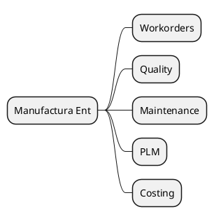

# Manufacturing v18 (Enterprise)

## Modules
- `[[Odoo 18/Enterprise Addons/Manufacturing/mrp_workorder.md]]`
- `[[Odoo 18/Enterprise Addons/Manufacturing/quality_control.md]]`
- `[[Odoo 18/Enterprise Addons/Manufacturing/maintenance_enterprise.md]]`
- `[[Odoo 18/Enterprise Addons/Manufacturing/mrp_plm.md]]`
- `[[Odoo 18/Enterprise Addons/Manufacturing/mrp_account_enterprise.md]]`

## Actions
- Document workshop flow with tablets.
- Integrate quality and maintenance with MRP.
-Analyze advanced costing.

## Navigation
- **Parent:** [[Odoo 18/Enterprise Addons]]

## Children
- [[Odoo 18/Enterprise Addons/Manufacturing/maintenance_enterprise]]
- [[Odoo 18/Enterprise Addons/Manufacturing/mrp_account_enterprise]]
- [[Odoo 18/Enterprise Addons/Manufacturing/mrp_plm]]
- [[Odoo 18/Enterprise Addons/Manufacturing/mrp_workorder]]
- [[Odoo 18/Enterprise Addons/Manufacturing/quality_control]]