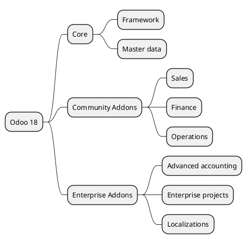

# Odoo 18 - Global Map

## Main structure
- `[[Odoo 18/Core]]` -> framework foundations and base modules.
- `[[Odoo 18/Community Addons]]` -> community modules shipped in the CE edition.
- `[[Odoo 18/Enterprise Addons]]` -> Enterprise extensions layered on top of community.

## Initial documentation priorities
- Identify foundational models (`res.partner`, `product.product`, `account.move`) and create base notes.
- Map business-critical end-to-end flows (Sales, Accounting, Projects).
- Capture preliminary differences versus v19 in `[[Comparisons]]`.

## Progress status
- Core: initial inventory pending.
- Community: no notes yet.
- Enterprise: no notes yet.

## Navigation
- **Parent:** [[Welcome]]
## Children
- [[Odoo 18/Community Addons/Community Addons]]
- [[Odoo 18/Core/Core]]
- [[Odoo 18/Enterprise Addons/Enterprise Addons]]
- [[Odoo 18/Examples/Examples]]
