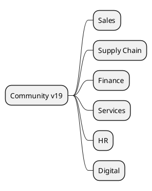

# Odoo 19 Community Addons

## Functional lines
- Sales and Customer Experience -> `[[Odoo 19/Community Addons/Sales]]`
- Supply Chain -> `[[Odoo 19/Community Addons/Supply Chain]]`
- Finance -> `[[Odoo 19/Community Addons/Finance]]`
- Services and projects -> `[[Odoo 19/Community Addons/Services]]`
- Talent and HR -> `[[Odoo 19/Community Addons/HR]]`
- Web, Marketing and Data -> `[[Odoo 19/Community Addons/Digital]]`

## Analysis approach
- Points out new modules introduced in v19.
- Detects merged or restructured modules.
- Evaluate implications of OWL UI and new widgets.

## References
- `[[Odoo 19/Core]]`
- `[[Comparisons]]`
- `[[Roadmap/Migrations 18 to 19]]`

## Navigation
- **Parent:** [[Odoo 19/Odoo 19]]
## Children
- [[Odoo 19/Community Addons/Digital/Digital]]
- [[Odoo 19/Community Addons/Finance/Finance]]
- [[Odoo 19/Community Addons/HR/HR]]
- [[Odoo 19/Community Addons/Sales/Sales]]
- [[Odoo 19/Community Addons/Services/Services]]
- [[Odoo 19/Community Addons/Supply Chain/Supply Chain]]
