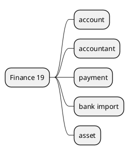

# Finance v19

## Modules
- `[[Odoo 19/Community Addons/Finance/account.md]]`
- `[[Odoo 19/Community Addons/Finance/account_accountant.md]]`
- `[[Odoo 19/Community Addons/Finance/account_payment.md]]`
- `[[Odoo 19/Community Addons/Finance/account_bank_statement_import.md]]`
- `[[Odoo 19/Community Addons/Finance/account_asset.md]]`

## Changes
- New accounting UI.
- AI automations for reconciliation.
- Integration with Documents and Excel.

## References
- `[[Comparisons/Accounting v18-v19]]`

## Navigation
- **Parent:** [[Odoo 19/Community Addons/Community Addons]]
## Children
- [[Odoo 19/Community Addons/Finance/account]]
- [[Odoo 19/Community Addons/Finance/account_accountant]]
- [[Odoo 19/Community Addons/Finance/account_asset]]
- [[Odoo 19/Community Addons/Finance/account_bank_statement_import]]
- [[Odoo 19/Community Addons/Finance/account_payment]]
