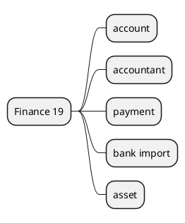

# Finance v19

## Modules
- `[[Odoo 19/Community Addons/Finance/account.md]]`
- `[[Odoo 19/Community Addons/Finance/account_accountant.md]]`
- `[[Odoo 19/Community Addons/Finance/account_payment.md]]`
- `[[Odoo 19/Community Addons/Finance/account_bank_statement_import.md]]`
- `[[Odoo 19/Community Addons/Finance/account_asset.md]]`

```plantuml
@startmindmap
* Finance 19
** account
** accountant
** payment
** bank import
** asset
@endmindmap
```

## Changes
- New accounting UI.
- AI automations for reconciliation.
- Integration with Documents and Excel.

## References
- `[[Comparisons/Accounting v18-v19]]`

## Navigation
- **Parent:** [[Odoo 19/Community Addons/Community Addons]]
## Children
- [[Odoo 19/Community Addons/Finance/account]]
- [[Odoo 19/Community Addons/Finance/account_accountant]]
- [[Odoo 19/Community Addons/Finance/account_asset]]
- [[Odoo 19/Community Addons/Finance/account_bank_statement_import]]
- [[Odoo 19/Community Addons/Finance/account_payment]]
<!-- GENERATED:CATEGORY -->
---
tags: [odoo, v19, community, index, category]
---

# Finance

Modules: 20

- [[Odoo 19/Community Addons/account/account|account]]
- [[Odoo 19/Community Addons/account_check_printing/account_check_printing|account_check_printing]]
- [[Odoo 19/Community Addons/account_debit_note/account_debit_note|account_debit_note]]
- [[Odoo 19/Community Addons/account_edi/account_edi|account_edi]]
- [[Odoo 19/Community Addons/account_edi_proxy_client/account_edi_proxy_client|account_edi_proxy_client]]
- [[Odoo 19/Community Addons/account_edi_ubl_cii/account_edi_ubl_cii|account_edi_ubl_cii]]
- [[Odoo 19/Community Addons/account_fleet/account_fleet|account_fleet]]
- [[Odoo 19/Community Addons/account_payment/account_payment|account_payment]]
- [[Odoo 19/Community Addons/account_peppol/account_peppol|account_peppol]]
- [[Odoo 19/Community Addons/account_peppol_advanced_fields/account_peppol_advanced_fields|account_peppol_advanced_fields]]
- [[Odoo 19/Community Addons/account_qr_code_emv/account_qr_code_emv|account_qr_code_emv]]
- [[Odoo 19/Community Addons/account_qr_code_sepa/account_qr_code_sepa|account_qr_code_sepa]]
- [[Odoo 19/Community Addons/account_tax_python/account_tax_python|account_tax_python]]
- [[Odoo 19/Community Addons/account_test/account_test|account_test]]
- [[Odoo 19/Community Addons/account_update_tax_tags/account_update_tax_tags|account_update_tax_tags]]
- [[Odoo 19/Community Addons/analytic/analytic|analytic]]
- [[Odoo 19/Community Addons/base_iban/base_iban|base_iban]]
- [[Odoo 19/Community Addons/base_vat/base_vat|base_vat]]
- [[Odoo 19/Community Addons/product_email_template/product_email_template|product_email_template]]
- [[Odoo 19/Community Addons/spreadsheet_account/spreadsheet_account|spreadsheet_account]]
<!-- GENERATED:CATEGORY -->
