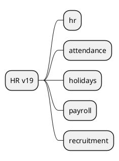

# HR v19

## Modules
- `[[Odoo 19/Community Addons/HR/hr.md]]`
- `[[Odoo 19/Community Addons/HR/hr_attendance.md]]`
- `[[Odoo 19/Community Addons/HR/hr_holidays.md]]`
- `[[Odoo 19/Community Addons/HR/hr_payroll.md]]`
- `[[Odoo 19/Community Addons/HR/hr_recruitment.md]]`

## Changes vs v18
- Improvements in digital onboarding.
- New recruiting features.
- Integration with eSign and Documents.

## References
- `[[Comparisons/HR v18-v19]]`

