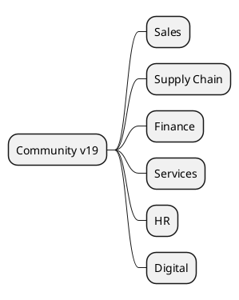

# Odoo 19 Community Addons

## Functional lines
- Sales and Customer Experience -> `[[Odoo 19/Community Addons/Sales/Index]]`
- Supply Chain -> `[[Odoo 19/Community Addons/Supply Chain/Index]]`
- Finance -> `[[Odoo 19/Community Addons/Finance/Index]]`
- Services and projects -> `[[Odoo 19/Community Addons/Services/Index]]`
- Talent and HR -> `[[Odoo 19/Community Addons/HR/Index]]`
- Web, Marketing and Data -> `[[Odoo 19/Community Addons/Digital/Index]]`

## Analysis approach
- Points out new modules introduced in v19.
- Detects merged or restructured modules.
- Evaluate implications of OWL UI and new widgets.

## References
- `[[Odoo 19/Core/Index]]`
- `[[Comparisons/Index]]`
- `[[Roadmap/Migrations 18 to 19]]`

