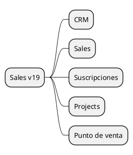

# Sales and CRM v19

## Modules
- `[[Odoo 19/Community Addons/Sales/crm.md]]`
- `[[Odoo 19/Community Addons/Sales/sale_management.md]]`
- `[[Odoo 19/Community Addons/Sales/sale_subscription.md]]`
- `[[Odoo 19/Community Addons/Sales/sale_project.md]]`
- `[[Odoo 19/Community Addons/Sales/pos_sale.md]]`

## Changes vs v18
- New pipeline widgets.
- Close integration with Sign and Documents.
- Renewal automations.

## References
- `[[Comparisons/Sales v18-v19]]`

## Navigation
- **Parent:** [[Odoo 19/Community Addons/Index]]

## Children
- [[Odoo 19/Community Addons/Sales/crm]]
- [[Odoo 19/Community Addons/Sales/pos_sale]]
- [[Odoo 19/Community Addons/Sales/sale_management]]
- [[Odoo 19/Community Addons/Sales/sale_project]]
- [[Odoo 19/Community Addons/Sales/sale_subscription]]