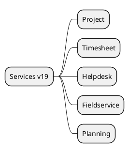

# Services & Project v19

## Modules
- `[[Odoo 19/Community Addons/Services/project.md]]`
- `[[Odoo 19/Community Addons/Services/timesheet.md]]`
- `[[Odoo 19/Community Addons/Services/helpdesk.md]]`
- `[[Odoo 19/Community Addons/Services/fieldservice.md]]`
- `[[Odoo 19/Community Addons/Services/planning.md]]`

## Changes
- New OWL planned view.
- Integration with Documents and Chat.
- Improvements in automatic assignment.

## References
- `[[Comparisons/Services v18-v19]]`

## Navigation
- **Parent:** [[Odoo 19/Community Addons]]

## Children
- [[Odoo 19/Community Addons/Services/fieldservice]]
- [[Odoo 19/Community Addons/Services/helpdesk]]
- [[Odoo 19/Community Addons/Services/planning]]
- [[Odoo 19/Community Addons/Services/project]]
- [[Odoo 19/Community Addons/Services/timesheet]]