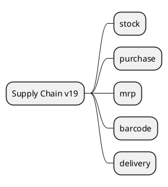

# SupplyChain v19

## Modules
- `[[Odoo 19/Community Addons/Supply Chain/stock.md]]`
- `[[Odoo 19/Community Addons/Supply Chain/purchase.md]]`
- `[[Odoo 19/Community Addons/Supply Chain/mrp.md]]`
- `[[Odoo 19/Community Addons/Supply Chain/stock_barcode.md]]`
- `[[Odoo 19/Community Addons/Supply Chain/delivery.md]]`

## Key changes
- OWL interfaces for picking and purchasing.
- Improvements in MRP planning.
- Integration with logistics providers and shipping APIs.

## References
- `[[Comparisons/Inventory v18-v19]]`

## Navigation
- **Parent:** [[Odoo 19/Community Addons/Community Addons]]
## Children
- [[Odoo 19/Community Addons/Supply Chain/delivery]]
- [[Odoo 19/Community Addons/Supply Chain/mrp]]
- [[Odoo 19/Community Addons/Supply Chain/purchase]]
- [[Odoo 19/Community Addons/Supply Chain/stock]]
- [[Odoo 19/Community Addons/Supply Chain/stock_barcode]]
