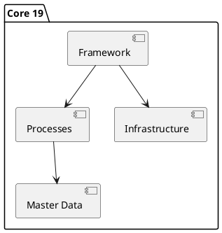

# Odoo 19 Core

## Key areas
- Modernized Framework -> `[[Odoo 19/Core/Framework]]`
- Master models -> `[[Odoo 19/Core/Master Data]]`
- Transversal processes -> `[[Odoo 19/Core/Processes]]`
- Technical infrastructure -> `[[Odoo 19/Core/Infrastructure]]`
- Integrations and APIs -> `[[Odoo 19/Core/Integrations]]`

## Points of attention
- Changes in ORM and RPC API.
- Performance and caching improvements.
- OWL view refactorings.

## Checklist
- [ ] Identify added/removed core modules vs v18.
- [ ] Document new decorators or patterns in the ORM.
- [ ] Map new bus/event capabilities.

## Navigation
- **Parent:** [[Odoo 19/Odoo 19]]
## Children
- [[Odoo 19/Core/Framework/Framework]]
- [[Odoo 19/Core/Infrastructure/Infrastructure]]
- [[Odoo 19/Core/Integrations/Integrations]]
- [[Odoo 19/Core/Master Data/Master Data]]
- [[Odoo 19/Core/Processes/Processes]]
