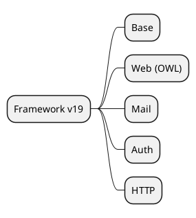

# Core Framework v19

## Prioritized modules
- `[[Odoo 19/Core/Framework/base.md]]`
- `[[Odoo 19/Core/Framework/web.md]]`
- `[[Odoo 19/Core/Framework/mail.md]]`
- `[[Odoo 19/Core/Framework/auth.md]]`
- `[[Odoo 19/Core/Framework/http.md]]`

## Changes vs v18
- OWL 2 and component composition.
-Asset bundler settings.
- Improvements in authentication and security.

## Tasks
- Document new JS APIs and hooks.
- Compare ORM v19 vs v18.
- Record breaking changes detected.

## Navigation
- **Parent:** [[Odoo 19/Core/Index]]

## Children
- [[Odoo 19/Core/Framework/auth]]
- [[Odoo 19/Core/Framework/base]]
- [[Odoo 19/Core/Framework/http]]
- [[Odoo 19/Core/Framework/mail]]
- [[Odoo 19/Core/Framework/web]]