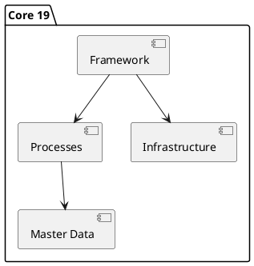

# Odoo 19 Core

## Key areas
- Modernized Framework -> `[[Odoo 19/Core/Framework/Index]]`
- Master models -> `[[Odoo 19/Core/Master Data/Index]]`
- Transversal processes -> `[[Odoo 19/Core/Processes/Index]]`
- Technical infrastructure -> `[[Odoo 19/Core/Infrastructure/Index]]`
- Integrations and APIs -> `[[Odoo 19/Core/Integrations/Index]]`

## Points of attention
- Changes in ORM and RPC API.
- Performance and caching improvements.
- OWL view refactorings.

## Checklist
- [ ] Identify added/removed core modules vs v18.
- [ ] Document new decorators or patterns in the ORM.
- [ ] Map new bus/event capabilities.

## Navigation
- **Parent**: `[[Odoo 19/Index]]`
- **Children**:
  - `[[Odoo 19/Core/Framework/Index]]`
  - `[[Odoo 19/Core/Master Data/Index]]`
  - `[[Odoo 19/Core/Processes/Index]]`
  - `[[Odoo 19/Core/Infrastructure/Index]]`
  - `[[Odoo 19/Core/Integrations/Index]]`

## Children
- [[Odoo 19/Core/Framework/Index]]
- [[Odoo 19/Core/Infrastructure/Index]]
- [[Odoo 19/Core/Integrations/Index]]
- [[Odoo 19/Core/Master Data/Index]]
- [[Odoo 19/Core/Processes/Index]]