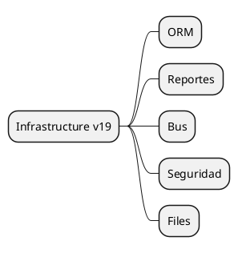

# Core Infrastructure v19

## Components
- ORM updated -> `[[Odoo 19/Core/Infrastructure/ORM.md]]`
- Reporteria -> `[[Odoo 19/Core/Infrastructure/Reportes.md]]`
- Bus/events -> `[[Odoo 19/Core/Infrastructure/Bus.md]]`
- Security -> `[[Odoo 19/Core/Infrastructure/Seguridad.md]]`
- Files -> `[[Odoo 19/Core/Infrastructure/Files.md]]`

## Priorities
- Catalog ORM changes and caching.
- Document new reporting capabilities.
- Analyze improvements in security and compliance.

## Navigation
- **Parent:** [[Odoo 19/Core]]

## Children
- [[Odoo 19/Core/Infrastructure/Bus]]
- [[Odoo 19/Core/Infrastructure/Files]]
- [[Odoo 19/Core/Infrastructure/ORM]]
- [[Odoo 19/Core/Infrastructure/Reports]]
- [[Odoo 19/Core/Infrastructure/Security]]