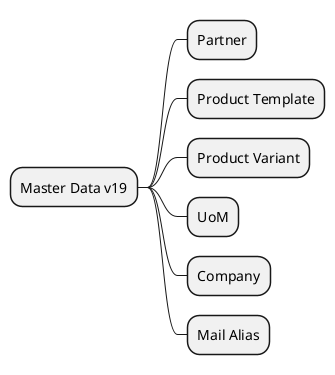

# CoreMasters v19

## Focus entities
- `[[Odoo 19/Core/Master Data/res_partner.md]]`
- `[[Odoo 19/Core/Master Data/product_template.md]]`
- `[[Odoo 19/Core/Master Data/product_product.md]]`
- `[[Odoo 19/Core/Master Data/uom_uom.md]]`
- `[[Odoo 19/Core/Master Data/res_company.md]]`
- `[[Odoo 19/Core/Master Data/mail_alias.md]]`

## Analysis
- Identify new fields vs v18.
- Evaluate new mixins or behaviors.
- Document reinforced multi-company restrictions.

## Navigation
- **Parent:** [[Odoo 19/Core/Index]]

## Children
- [[Odoo 19/Core/Master Data/mail_alias]]
- [[Odoo 19/Core/Master Data/product_product]]
- [[Odoo 19/Core/Master Data/product_template]]
- [[Odoo 19/Core/Master Data/res_company]]
- [[Odoo 19/Core/Master Data/res_partner]]
- [[Odoo 19/Core/Master Data/uom_uom]]