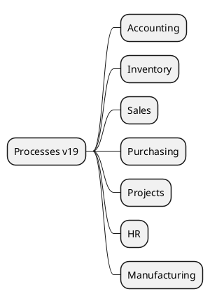

# Core Processes v19

## Core flows
- Accounting -> `[[Odoo 19/Core/Processes/Accounting/Index]]`
- Inventory -> `[[Odoo 19/Core/Processes/Inventory/Index]]`
- Sales -> `[[Odoo 19/Core/Processes/Sales/Index]]`
- Purchasing -> `[[Odoo 19/Core/Processes/Purchasing/Index]]`
- Projects -> `[[Odoo 19/Core/Processes/Projects/Index]]`
- HR -> `[[Odoo 19/Core/Processes/HR/Index]]`
- Manufacturing -> `[[Odoo 19/Core/Processes/Manufacturing/Index]]`

## Key changes
- New workflows and states across major applications.
- OWL-based UI enhancements for kanban and list views.
- Performance improvements for bulk validations.

## Navigation
- **Parent:** [[Odoo 19/Core/Index]]

## Children
- [[Odoo 19/Core/Processes/Accounting/Index]]
- [[Odoo 19/Core/Processes/HR/Index]]
- [[Odoo 19/Core/Processes/Inventory/Index]]
- [[Odoo 19/Core/Processes/Manufacturing/Index]]
- [[Odoo 19/Core/Processes/Projects/Index]]
- [[Odoo 19/Core/Processes/Purchasing/Index]]
- [[Odoo 19/Core/Processes/Sales/Index]]