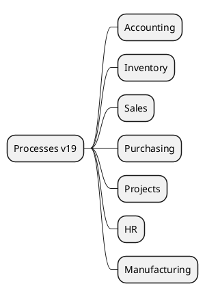

# Core Processes v19

## Core flows
- Accounting -> `[[Odoo 19/Core/Processes/Accounting]]`
- Inventory -> `[[Odoo 19/Core/Processes/Inventory]]`
- Sales -> `[[Odoo 19/Core/Processes/Sales]]`
- Purchasing -> `[[Odoo 19/Core/Processes/Purchasing]]`
- Projects -> `[[Odoo 19/Core/Processes/Projects]]`
- HR -> `[[Odoo 19/Core/Processes/HR]]`
- Manufacturing -> `[[Odoo 19/Core/Processes/Manufacturing]]`

## Key changes
- New workflows and states across major applications.
- OWL-based UI enhancements for kanban and list views.
- Performance improvements for bulk validations.

## Navigation
- **Parent:** [[Odoo 19/Core/Core]]
## Children
- [[Odoo 19/Core/Processes/Accounting/Accounting]]
- [[Odoo 19/Core/Processes/HR/HR]]
- [[Odoo 19/Core/Processes/Inventory/Inventory]]
- [[Odoo 19/Core/Processes/Manufacturing/Manufacturing]]
- [[Odoo 19/Core/Processes/Projects/Projects]]
- [[Odoo 19/Core/Processes/Purchasing/Purchasing]]
- [[Odoo 19/Core/Processes/Sales/Sales]]
