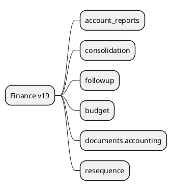

# AdvancedFinance v19

## Modules
- `[[Odoo 19/Enterprise Addons/Advanced Finance/account_reports.md]]`
- `[[Odoo 19/Enterprise Addons/Advanced Finance/account_consolidation.md]]`
- `[[Odoo 19/Enterprise Addons/Advanced Finance/account_followup.md]]`
- `[[Odoo 19/Enterprise Addons/Advanced Finance/account_budget.md]]`
- `[[Odoo 19/Enterprise Addons/Advanced Finance/documents_accounting.md]]`
- `[[Odoo 19/Enterprise Addons/Advanced Finance/account_resequence.md]]`

## Changes and v18
- Expanded dynamic and comparative reports.
- Automation with AI in collections.
- Documentary OCR with precision improvements.

## References
- `[[Comparisons/Enterprise Finance v18-v19]]`

## Navigation
- **Parent:** [[Odoo 19/Enterprise Addons/Enterprise Addons]]
## Children
- [[Odoo 19/Enterprise Addons/Advanced Finance/account_budget]]
- [[Odoo 19/Enterprise Addons/Advanced Finance/account_consolidation]]
- [[Odoo 19/Enterprise Addons/Advanced Finance/account_followup]]
- [[Odoo 19/Enterprise Addons/Advanced Finance/account_reports]]
- [[Odoo 19/Enterprise Addons/Advanced Finance/account_resequence]]
- [[Odoo 19/Enterprise Addons/Advanced Finance/documents_accounting]]
