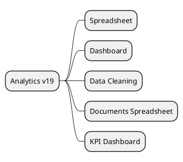

# Analytics & BI v19

## Modules
- `[[Odoo 19/Enterprise Addons/Analytics/spreadsheet_enterprise.md]]`
- `[[Odoo 19/Enterprise Addons/Analytics/dashboard_enterprise.md]]`
- `[[Odoo 19/Enterprise Addons/Analytics/data_cleaning.md]]`
- `[[Odoo 19/Enterprise Addons/Analytics/documents_spreadsheet.md]]`
- `[[Odoo 19/Enterprise Addons/Analytics/kpi_dashboard.md]]`

## Changes
- Integration with AI tools.
- Dashboard in real time.
- Improvements in data cleaning and quality.

## Navigation
- **Parent:** [[Odoo 19/Enterprise Addons/Enterprise Addons]]
## Children
- [[Odoo 19/Enterprise Addons/Analytics/dashboard_enterprise]]
- [[Odoo 19/Enterprise Addons/Analytics/data_cleaning]]
- [[Odoo 19/Enterprise Addons/Analytics/documents_spreadsheet]]
- [[Odoo 19/Enterprise Addons/Analytics/kpi_dashboard]]
- [[Odoo 19/Enterprise Addons/Analytics/spreadsheet_enterprise]]
