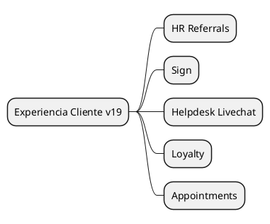

# CustomerExperience v19

## Modules
- `[[Odoo 19/Enterprise Addons/Customer Experience/hr_referrals.md]]`
- `[[Odoo 19/Enterprise Addons/Customer Experience/sign_enterprise.md]]`
- `[[Odoo 19/Enterprise Addons/Customer Experience/website_helpdesk_livechat.md]]`
- `[[Odoo 19/Enterprise Addons/Customer Experience/loyalty_enterprise.md]]`
- `[[Odoo 19/Enterprise Addons/Customer Experience/appointments_enterprise.md]]`

## Changes vs v18
- eSign integration in broader processes.
- Omnichannel loyalty programs.
- Portals and appointments with UX improvements.

## Navigation
- **Parent:** [[Odoo 19/Enterprise Addons/Index]]

## Children
- [[Odoo 19/Enterprise Addons/Customer Experience/appointments_enterprise]]
- [[Odoo 19/Enterprise Addons/Customer Experience/hr_referrals]]
- [[Odoo 19/Enterprise Addons/Customer Experience/loyalty_enterprise]]
- [[Odoo 19/Enterprise Addons/Customer Experience/sign_enterprise]]
- [[Odoo 19/Enterprise Addons/Customer Experience/website_helpdesk_livechat]]