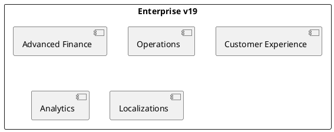

# Odoo 19 Enterprise Addons

## Portfolio
- Extended Finance -> `[[Odoo 19/Enterprise Addons/Advanced Finance]]`
- Smart Operations -> `[[Odoo 19/Enterprise Addons/Operations]]`
- Customer Experience -> `[[Odoo 19/Enterprise Addons/Customer Experience]]`
- Data Intelligence -> `[[Odoo 19/Enterprise Addons/Analytics]]`
- Localizations and Compliance -> `[[Odoo 19/Enterprise Addons/Localizations]]`

## Research questions
- What Enterprise improvements justify migrations from v18?
- Which modules change data models or flows?
- What new external integrations are introduced in v19?

## Connections
- `[[Odoo 19]]`
- `[[Comparisons]]`
- `[[Licensing/Enterprise Guide]]`

## Navigation
- **Parent:** [[Odoo 19]]

## Children
- [[Odoo 19/Enterprise Addons/Advanced Finance]]
- [[Odoo 19/Enterprise Addons/Analytics]]
- [[Odoo 19/Enterprise Addons/Customer Experience]]
- [[Odoo 19/Enterprise Addons/Localizations]]
- [[Odoo 19/Enterprise Addons/Operations]]