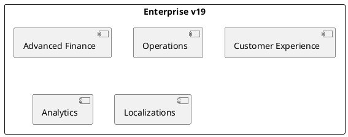

# Odoo 19 Enterprise Addons

## Portfolio
- Extended Finance -> `[[Odoo 19/Enterprise Addons/Advanced Finance]]`
- Smart Operations -> `[[Odoo 19/Enterprise Addons/Operations]]`
- Customer Experience -> `[[Odoo 19/Enterprise Addons/Customer Experience]]`
- Data Intelligence -> `[[Odoo 19/Enterprise Addons/Analytics]]`
- Localizations and Compliance -> `[[Odoo 19/Enterprise Addons/Localizations]]`

```plantuml
@startuml
rectangle "Enterprise v19" {
  [Advanced Finance]
  [Operations]
  [Customer Experience]
  [Analytics]
  [Localizations]
}
@enduml
```

## Research questions
- What Enterprise improvements justify migrations from v18?
- Which modules change data models or flows?
- What new external integrations are introduced in v19?

## Connections
- `[[Odoo 19]]`
- `[[Comparisons]]`
- `[[Licensing/Enterprise Guide]]`

## Navigation
- **Parent:** [[Odoo 19/Odoo 19]]
## Children
- [[Odoo 19/Enterprise Addons/Advanced Finance/Advanced Finance]]
- [[Odoo 19/Enterprise Addons/Analytics/Analytics]]
- [[Odoo 19/Enterprise Addons/Customer Experience/Customer Experience]]
- [[Odoo 19/Enterprise Addons/Localizations/Localizations]]
- [[Odoo 19/Enterprise Addons/Operations/Operations]]
<!-- GENERATED:CATEGORIES -->
## Categories

- [[Odoo 19/Enterprise Addons/Communication/Communication|Communication]] (2)
- [[Odoo 19/Enterprise Addons/Finance/Finance|Finance]] (50)
- [[Odoo 19/Enterprise Addons/HR/HR|HR]] (53)
- [[Odoo 19/Enterprise Addons/Inventory/Inventory|Inventory]] (29)
- [[Odoo 19/Enterprise Addons/Localizations/Localizations|Localizations]] (271)
- [[Odoo 19/Enterprise Addons/Marketing/Marketing|Marketing]] (22)
- [[Odoo 19/Enterprise Addons/Misc/Misc|Misc]] (75)
- [[Odoo 19/Enterprise Addons/Payments/Payments|Payments]] (1)
- [[Odoo 19/Enterprise Addons/Point of Sale/Point of Sale|Point of Sale]] (29)
- [[Odoo 19/Enterprise Addons/Sales/Sales|Sales]] (42)
- [[Odoo 19/Enterprise Addons/Services/Services|Services]] (95)
- [[Odoo 19/Enterprise Addons/Technical/Technical|Technical]] (8)
- [[Odoo 19/Enterprise Addons/Website/Website|Website]] (33)

<!-- GENERATED:CATEGORIES -->
