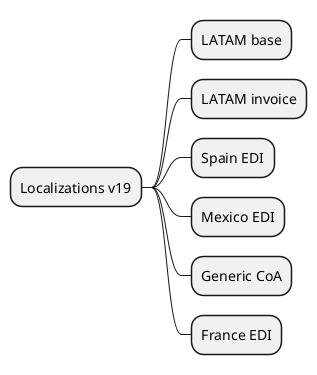

# Locations v19

## Modules
- `[[Odoo 19/Enterprise Addons/Localizations/l10n_latam_base.md]]`
- `[[Odoo 19/Enterprise Addons/Localizations/l10n_latam_invoice.md]]`
- `[[Odoo 19/Enterprise Addons/Localizations/l10n_es_edi.md]]`
- `[[Odoo 19/Enterprise Addons/Localizations/l10n_mx_edi.md]]`
- `[[Odoo 19/Enterprise Addons/Localizations/l10n_generic_coa.md]]`
- `[[Odoo 19/Enterprise Addons/Localizations/l10n_fr_edi.md]]`

## Changes vs v18
- New tax obligations incorporated.
- Electronic updates (CFDI 4.0, SII).
- Integrations with external services.

## Navigation
- **Parent:** [[Odoo 19/Enterprise Addons/Enterprise Addons]]
## Children
- [[Odoo 19/Enterprise Addons/Localizations/l10n_es_edi]]
- [[Odoo 19/Enterprise Addons/Localizations/l10n_fr_edi]]
- [[Odoo 19/Enterprise Addons/Localizations/l10n_generic_coa]]
- [[Odoo 19/Enterprise Addons/Localizations/l10n_latam_base]]
- [[Odoo 19/Enterprise Addons/Localizations/l10n_latam_invoice]]
- [[Odoo 19/Enterprise Addons/Localizations/l10n_mx_edi]]
