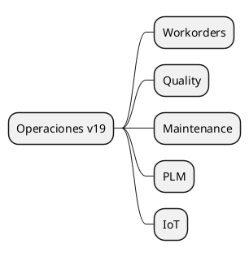

# Smart Operations v19

## Modules
- `[[Odoo 19/Enterprise Addons/Operations/mrp_workorder.md]]`
- `[[Odoo 19/Enterprise Addons/Operations/quality_control.md]]`
- `[[Odoo 19/Enterprise Addons/Operations/maintenance_enterprise.md]]`
- `[[Odoo 19/Enterprise Addons/Operations/mrp_plm.md]]`
- `[[Odoo 19/Enterprise Addons/Operations/iot_enterprise.md]]`

## Changes vs v18
- Updated template UI.
- Integration with IoT boxes and sensors.
- Advanced maintenance analytics.

## Navigation
- **Parent:** [[Odoo 19/Enterprise Addons/Index]]

## Children
- [[Odoo 19/Enterprise Addons/Operations/iot_enterprise]]
- [[Odoo 19/Enterprise Addons/Operations/maintenance_enterprise]]
- [[Odoo 19/Enterprise Addons/Operations/mrp_plm]]
- [[Odoo 19/Enterprise Addons/Operations/mrp_workorder]]
- [[Odoo 19/Enterprise Addons/Operations/quality_control]]