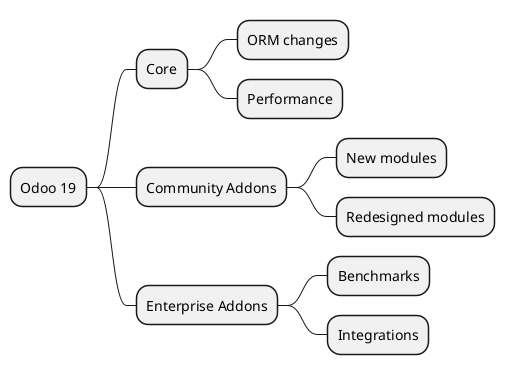

# Odoo 19 - Global Map

## Main structure
- `[[Odoo 19/Core]]` -> renewed technical base and framework improvements.
- `[[Odoo 19/Community Addons]]` -> standard capabilities in CE 19.
- `[[Odoo 19/Enterprise Addons]]` -> premium features for version 19.

## Baseline comparison
- Document changes vs v18 in `[[Comparisons]]`.
- Flag deprecated or renamed modules.
- Register user experience and API improvements.

## Progress status
- Core: no notes yet.
- Community: no notes yet.
- Enterprise: no notes yet.

## Navigation
- **Parent:** [[Welcome]]
## Children
- [[Odoo 19/Community Addons/Community Addons]]
- [[Odoo 19/Core/Core]]
- [[Odoo 19/Enterprise Addons/Enterprise Addons]]
