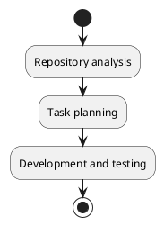

# Migrations 18 -> 19

## Objectives
- Plan the technical migration.
- Evaluate business impacts.
- Define an iterative schedule.

## Milestones
- [ ] Inventory custom modules.
- [ ] Assess Enterprise dependencies.
- [ ] Define the data migration strategy.
- [ ] Run end-to-end tests.

## Diagram

## References
- `[[Comparisons]]`
- `[[Templates/Cross-Version Diff Template]]`

## Navigation
- **Parent:** [[Welcome]]
