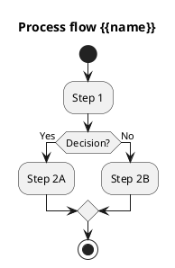

# Process {{name}}

## Overview
- **Objective**:
- **Actors**:
- **Triggers**:
- **Key metrics**:

## Artifact inventory
- Involved models:
- Business rules:
- Forms/views:
- Reports:
- Automations:

## Risk analysis
-

## Improvement opportunities
-

## Roadmap and backlog
-

## Cross references
- `[[Related Module]]`
- Code: `path/to/file.py:123`
- External documentation:

## Navigation
- **Parent:** [[Welcome]]
