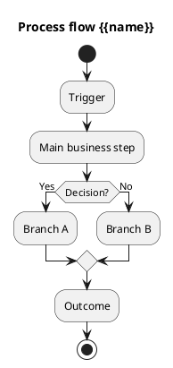

# Process {{name}}

## Overview
- Objective:
- Actors:
- Triggers:
- Output:

```plantuml
@startuml
title Process flow {{name}}
start
:Trigger;
:Main business step;
if (Decision?) then (Yes)
  :Branch A;
else (No)
  :Branch B;
endif
:Outcome;
stop
@enduml
```

## Modules involved
- `[[Related Module 1]]`
- `[[Related Module 2]]`

## Evidence
- Models:
- Views:
- Security:
- Reports:
- Automations:
- Tests:

## Operational risks
- Failure points:
- Manual workarounds:
- Audit or compliance concerns:

## Follow-up
- Gaps in current documentation:
- Next notes to create:
