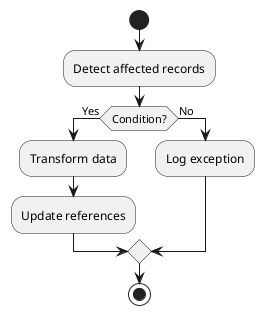

# Differences {{area}} v18 vs v19

## Quick summary
- **Functional area**:
- **Business impact**: high|medium|low
- **Technical impact**: model|view|service|security|data
- **Migration recommendation**:

```plantuml
@startuml
skinparam monochrome true
partition "Odoo 18" {
  [Object v18] --> [Process v18]
}
partition "Odoo 19" {
  [Object v19] --> [Process v19]
}
[Process v18] --> [Process v19] : key changes
@enduml
```

## Functional changes
-

## Technical changes
- Models:
- Fields:
- Methods:
- Security:
- Views:
- Tests:

## Suggested migration script


## Validation checklist
- [ ] Unit tests executed
- [ ] Critical functional tests
- [ ] Review integrations
- [ ] Update user documentation

## Notes and questions
-

## References
- v18 code:
- v19 code:
- External documentation:
