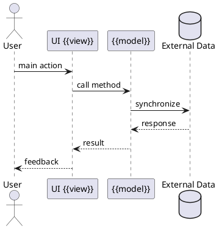

# {{Module name}} (`{{technical_name}}`)

## Executive summary
- **Functional domain**:
- **Business objective**:
- **Key impact**:
- **Primary dependencies**: `[[{{dependency}}]]`

```plantuml
@startmindmap
* Key objects {{technical_name}}
** Main use cases
***
** Stakeholders
***
** External systems
***
@endmindmap
```

## Business canvas #business #{{domain_tag}}
- **Involved roles**:
- **Affected KPIs**:
- **Critical business rules**:

## Functional architecture
### Models and entities #model
- `res.company`: description / customizations
- ...

```plantuml
@startuml
skinparam classAttributeIconSize 0
class {{primary_model}} {
  +field_a: type
  ..
  +key_method()
}
{{primary_model}} --> {{related_model}} : relationship
@enduml
```

### Services and data flow #service
1. Trigger event
2. Validations
3. Follow-up actions



## Technical depth
- **Models**: overridden classes and mixins
- **Key fields**: required, computed, inverse
- **Critical methods**: scenarios, signature, side effects
- **Views**: form, tree, kanban, constraints
- **Security**: access rules, record rules, groups
- **Automations**: cron, server actions, bus, mail templates
- **Tests**: location, coverage, gaps

## Data and migrations
- Most relevant XML/CSV references
- Changes between v18 and v19 impacting data

## Integrations and APIs
- REST/Odoo RPC endpoints
- Webhooks and flows with external services

## Risks and technical debt
-

## Open questions
-

## Cross references
- Code: `path/to/file.py:123`
- Related documents: `[[Another Note]]`
- Issues/Tasks:

---
> Use this template as a starting point and duplicate the note inside the relevant folder before populating it.


## Navigation
- **Parent:** [[Welcome]]
