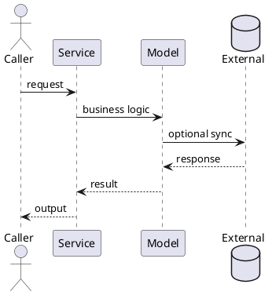

# Service `{{service_name}}`

- Module: `{{module_name}}`
- Entry point: `{{source_path}}`

## Purpose
- Trigger:
- Consumers:
- Expected outcome:

## Flow
1. Input arrives
2. Validation happens
3. Core logic executes
4. Side effects are emitted

## Dependencies
- Internal modules:
- External services:

## Risks
- Failure modes:
- Retries / idempotency:
- Security considerations:
