<!-- GENERATED:MODEL -->
---
tags: [odoo, community, generated, model]
---

# hr.bank.account.allocation.wizard.line

- Module: [[docs/Community Addons/hr/hr|hr]]
- Scope: Community Addons
- Defined in module: yes
- Source files: `wizard/hr_bank_account_allocation_wizard_line.py`
- Python classes: `BankAccountAllocationLineWizard`
- Description: Bank Account Allocation Line (Wizard)

## Field footprint

- Detected fields: 8
- Field types: `Boolean` x 1, `Char` x 2, `Float` x 1, `Integer` x 1, `Many2one` x 2, `Selection` x 1
- Relation fields: 2

## Sample fields

- `acc_number`: `Char` (related `bank_account_id.acc_number`)
- `amount`: `Float`
- `amount_type`: `Selection`
- `bank_account_id`: `Many2one` (comodel `res.partner.bank`)
- `sequence`: `Integer`
- `symbol`: `Char` (compute `_compute_symbol`)
- `trusted`: `Boolean`
- `wizard_id`: `Many2one` (comodel `hr.bank.account.allocation.wizard`)

## Method hints

- Detected methods: 2
- Action methods: none
- Compute methods: `_compute_symbol`
- Onchange methods: none

## Direct relation diagram

```plantuml
@startuml
!define ODOO_COLOR_PRIMARY #714B67
!define ODOO_COLOR_ACCENT #875A7B
!define ODOO_COLOR_BG #FAF7FA

skinparam backgroundColor ODOO_COLOR_BG
skinparam defaultTextAlignment left
skinparam ArrowColor ODOO_COLOR_ACCENT
skinparam ClassBackgroundColor white
skinparam ClassBorderColor ODOO_COLOR_PRIMARY
skinparam ComponentBackgroundColor white
skinparam ComponentBorderColor ODOO_COLOR_PRIMARY
skinparam NoteBackgroundColor #FFF8FF
skinparam NoteBorderColor ODOO_COLOR_ACCENT
skinparam SequenceLifeLineBorderColor ODOO_COLOR_ACCENT
skinparam SequenceLifeLineBackgroundColor #FFFFFF
skinparam SequenceParticipantBorderColor ODOO_COLOR_PRIMARY
skinparam SequenceParticipantBackgroundColor #FFFFFF
skinparam sequence {
  ArrowColor ODOO_COLOR_ACCENT
  ActorBorderColor ODOO_COLOR_PRIMARY
}
title hr.bank.account.allocation.wizard.line - Direct Relations
class "hr.bank.account.allocation.wizard.line" as hr_bank_account_allocation_wizard_line
class "hr.bank.account.allocation.wizard" as hr_bank_account_allocation_wizard
class "res.partner.bank" as res_partner_bank
hr_bank_account_allocation_wizard_line --> hr_bank_account_allocation_wizard : wizard_id
hr_bank_account_allocation_wizard_line --> res_partner_bank : bank_account_id
@enduml
```

## Navigation

- **Parent:** [[docs/Community Addons/hr/Models]]

<!-- GENERATED:MODEL -->
