<!-- GENERATED:MODEL -->
---
tags: [odoo, community, generated, model]
---

# hr.bank.account.allocation.wizard

- Module: [[docs/Community Addons/hr/hr|hr]]
- Scope: Community Addons
- Defined in module: yes
- Source files: `wizard/hr_bank_account_wizard.py`
- Python classes: `BankAccountAllocationWizard`
- Description: Bank Account Allocation Wizard

## Field footprint

- Detected fields: 2
- Field types: `Many2one` x 1, `One2many` x 1
- Relation fields: 2

## Sample fields

- `allocation_ids`: `One2many` (comodel `hr.bank.account.allocation.wizard.line`)
- `employee_id`: `Many2one` (comodel `hr.employee`)

## Method hints

- Detected methods: 3
- Action methods: `action_save`
- Compute methods: none
- Onchange methods: none

## Direct relation diagram

```plantuml
@startuml
!define ODOO_COLOR_PRIMARY #714B67
!define ODOO_COLOR_ACCENT #875A7B
!define ODOO_COLOR_BG #FAF7FA

skinparam backgroundColor ODOO_COLOR_BG
skinparam defaultTextAlignment left
skinparam ArrowColor ODOO_COLOR_ACCENT
skinparam ClassBackgroundColor white
skinparam ClassBorderColor ODOO_COLOR_PRIMARY
skinparam ComponentBackgroundColor white
skinparam ComponentBorderColor ODOO_COLOR_PRIMARY
skinparam NoteBackgroundColor #FFF8FF
skinparam NoteBorderColor ODOO_COLOR_ACCENT
skinparam SequenceLifeLineBorderColor ODOO_COLOR_ACCENT
skinparam SequenceLifeLineBackgroundColor #FFFFFF
skinparam SequenceParticipantBorderColor ODOO_COLOR_PRIMARY
skinparam SequenceParticipantBackgroundColor #FFFFFF
skinparam sequence {
  ArrowColor ODOO_COLOR_ACCENT
  ActorBorderColor ODOO_COLOR_PRIMARY
}
title hr.bank.account.allocation.wizard - Direct Relations
class "hr.bank.account.allocation.wizard" as hr_bank_account_allocation_wizard
class "hr.bank.account.allocation.wizard.line" as hr_bank_account_allocation_wizard_line
class "hr.employee" as hr_employee
hr_bank_account_allocation_wizard --> hr_employee : employee_id
hr_bank_account_allocation_wizard --|> hr_bank_account_allocation_wizard_line : allocation_ids
@enduml
```

## Navigation

- **Parent:** [[docs/Community Addons/hr/Models]]

<!-- GENERATED:MODEL -->
