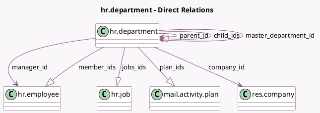

<!-- GENERATED:MODEL -->
---
tags: [odoo, community, generated, model]
---

# hr.department

- Module: [[docs/Community Addons/hr/hr|hr]]
- Scope: Community Addons
- Defined in module: yes
- Source files: `models/hr_department.py`
- Python classes: `HrDepartment`
- Description: Department
- Inherits: `mail.activity.mixin`, `mail.thread`

## Field footprint

- Detected fields: 17
- Field types: `Boolean` x 2, `Char` x 3, `Integer` x 3, `Many2one` x 4, `One2many` x 4, `Text` x 1
- Relation fields: 8

## Sample fields

- `active`: `Boolean` (comodel `Active`)
- `child_ids`: `One2many` (comodel `hr.department`)
- `color`: `Integer` (comodel `Color Index`)
- `company_id`: `Many2one` (comodel `res.company`)
- `complete_name`: `Char` (comodel `Complete Name`, compute `_compute_complete_name`)
- `has_read_access`: `Boolean` (store `False`)
- `jobs_ids`: `One2many` (comodel `hr.job`)
- `manager_id`: `Many2one` (comodel `hr.employee`)
- `master_department_id`: `Many2one` (comodel `hr.department`, compute `_compute_master_department_id`, store `True`)
- `member_ids`: `One2many` (comodel `hr.employee`)
- `name`: `Char` (comodel `Department Name`)
- `note`: `Text` (comodel `Note`)
- `parent_id`: `Many2one` (comodel `hr.department`)
- `parent_path`: `Char`
- `plan_ids`: `One2many` (comodel `mail.activity.plan`)
- `plans_count`: `Integer` (compute `_compute_plan_count`)
- `total_employee`: `Integer` (compute `_compute_total_employee`)

## Method hints

- Detected methods: 18
- Action methods: `action_employee_from_department`, `action_open_view_child_departments`, `action_plan_from_department`
- Compute methods: `_compute_complete_name`, `_compute_display_name`, `_compute_master_department_id`, `_compute_plan_count`, `_compute_total_employee`
- Onchange methods: none

## Direct relation diagram

## Navigation

- **Parent:** [[docs/Community Addons/hr/Models]]

<!-- GENERATED:MODEL -->
