<!-- GENERATED:MODEL -->
---
tags: [odoo, community, generated, model]
---

# hr.departure.wizard

- Module: [[docs/Community Addons/hr/hr|hr]]
- Scope: Community Addons
- Defined in module: yes
- Source files: `wizard/hr_departure_wizard.py`
- Python classes: `HrDepartureWizard`
- Description: Departure Wizard

## Field footprint

- Detected fields: 7
- Field types: `Boolean` x 3, `Date` x 1, `Html` x 1, `Many2many` x 1, `Many2one` x 1
- Relation fields: 2

## Sample fields

- `departure_date`: `Date`
- `departure_description`: `Html`
- `departure_reason_id`: `Many2one` (comodel `hr.departure.reason`)
- `employee_ids`: `Many2many` (comodel `hr.employee`)
- `is_user_employee`: `Boolean` (compute `_compute_is_user_employee`)
- `remove_related_user`: `Boolean`
- `set_date_end`: `Boolean`

## Method hints

- Detected methods: 5
- Action methods: `action_register_departure`
- Compute methods: `_compute_is_user_employee`
- Onchange methods: none

## Direct relation diagram

```plantuml
@startuml
!define ODOO_COLOR_PRIMARY #714B67
!define ODOO_COLOR_ACCENT #875A7B
!define ODOO_COLOR_BG #FAF7FA

skinparam backgroundColor ODOO_COLOR_BG
skinparam defaultTextAlignment left
skinparam ArrowColor ODOO_COLOR_ACCENT
skinparam ClassBackgroundColor white
skinparam ClassBorderColor ODOO_COLOR_PRIMARY
skinparam ComponentBackgroundColor white
skinparam ComponentBorderColor ODOO_COLOR_PRIMARY
skinparam NoteBackgroundColor #FFF8FF
skinparam NoteBorderColor ODOO_COLOR_ACCENT
skinparam SequenceLifeLineBorderColor ODOO_COLOR_ACCENT
skinparam SequenceLifeLineBackgroundColor #FFFFFF
skinparam SequenceParticipantBorderColor ODOO_COLOR_PRIMARY
skinparam SequenceParticipantBackgroundColor #FFFFFF
skinparam sequence {
  ArrowColor ODOO_COLOR_ACCENT
  ActorBorderColor ODOO_COLOR_PRIMARY
}
title hr.departure.wizard - Direct Relations
class "hr.departure.wizard" as hr_departure_wizard
class "hr.departure.reason" as hr_departure_reason
class "hr.employee" as hr_employee
hr_departure_wizard --> hr_departure_reason : departure_reason_id
hr_departure_wizard .. hr_employee : employee_ids
@enduml
```

## Navigation

- **Parent:** [[docs/Community Addons/hr/Models]]

<!-- GENERATED:MODEL -->
