<!-- GENERATED:MODEL -->
---
tags: [odoo, community, generated, model]
---

# hr.employee

- Module: [[docs/Community Addons/hr/hr|hr]]
- Scope: Community Addons
- Defined in module: yes
- Source files: `models/hr_employee.py`
- Python classes: `HrEmployee`
- Description: Employee
- Inherits: `avatar.mixin`, `mail.activity.mixin`, `mail.thread.main.attachment`, `resource.mixin`

## Field footprint

- Detected fields: 103
- Field types: `Binary` x 3, `Boolean` x 17, `Char` x 28, `Date` x 12, `Integer` x 6, `Json` x 1, `Many2many` x 3, `Many2one` x 19, `Monetary` x 1, `One2many` x 5, `Properties` x 1, `Selection` x 7
- Relation fields: 27

## Sample fields

- `active`: `Boolean` (comodel `Active`, related `resource_id.active`, store `True`)
- `activity_date_deadline`: `Date`
- `activity_exception_decoration`: `Selection`
- `activity_exception_icon`: `Char`
- `activity_ids`: `One2many`
- `activity_state`: `Selection`
- `activity_summary`: `Char`
- `activity_type_icon`: `Char`
- `activity_type_id`: `Many2one`
- `activity_user_id`: `Many2one`
- `bank_account_ids`: `Many2many` (comodel `res.partner.bank`)
- `barcode`: `Char`
- `birthday`: `Date` (comodel `Birthday`)
- `birthday_public_display`: `Boolean` (comodel `Show to all employees`)
- `birthday_public_display_string`: `Char` (comodel `Public Date of Birth`, compute `_compute_birthday_public_display_string`)
- `category_ids`: `Many2many` (comodel `hr.employee.category`)
- `certificate`: `Selection`
- `child_ids`: `One2many` (comodel `hr.employee`)
- `coach_id`: `Many2one` (comodel `hr.employee`, compute `_compute_coach`, store `True`)
- `color`: `Integer` (comodel `Color Index`)

## Method hints

- Detected methods: 117
- Action methods: `action_archive`, `action_create_user`, `action_create_users`, `action_create_users_confirmation`, `action_open_allocation_wizard`, `action_open_versions`, `action_related_contacts`, `action_toggle_primary_bank_account_trust`, and 1 more
- Compute methods: `_compute_avatar`, `_compute_avatar_1024`, `_compute_avatar_128`, `_compute_avatar_1920`, `_compute_avatar_256`, `_compute_avatar_512`, `_compute_birthday_public_display_string`, `_compute_coach`, and 18 more
- Onchange methods: `_onchange_company_id`, `_onchange_contract_date_start`, `_onchange_contract_template_id`, `_onchange_phone_validation_employee`, `_onchange_private_state_id`, `_onchange_timezone`, `_onchange_user`

## Direct relation diagram

```plantuml
@startuml
!define ODOO_COLOR_PRIMARY #714B67
!define ODOO_COLOR_ACCENT #875A7B
!define ODOO_COLOR_BG #FAF7FA

skinparam backgroundColor ODOO_COLOR_BG
skinparam defaultTextAlignment left
skinparam ArrowColor ODOO_COLOR_ACCENT
skinparam ClassBackgroundColor white
skinparam ClassBorderColor ODOO_COLOR_PRIMARY
skinparam ComponentBackgroundColor white
skinparam ComponentBorderColor ODOO_COLOR_PRIMARY
skinparam NoteBackgroundColor #FFF8FF
skinparam NoteBorderColor ODOO_COLOR_ACCENT
skinparam SequenceLifeLineBorderColor ODOO_COLOR_ACCENT
skinparam SequenceLifeLineBackgroundColor #FFFFFF
skinparam SequenceParticipantBorderColor ODOO_COLOR_PRIMARY
skinparam SequenceParticipantBackgroundColor #FFFFFF
skinparam sequence {
  ArrowColor ODOO_COLOR_ACCENT
  ActorBorderColor ODOO_COLOR_PRIMARY
}
title hr.employee - Direct Relations
class "hr.employee" as hr_employee
class "hr.employee" as hr_employee
class "hr.employee.category" as hr_employee_category
class "hr.version" as hr_version
class "res.company" as res_company
class "res.country" as res_country
class "res.currency" as res_currency
class "res.partner" as res_partner
class "res.partner.bank" as res_partner_bank
class "res.users" as res_users
class "resource.resource" as resource_resource
hr_employee --> hr_version : version_id
hr_employee --> hr_version : current_version_id
hr_employee --|> hr_version : version_ids
hr_employee --> resource_resource : resource_id
hr_employee --> res_users : user_id
hr_employee --> res_company : company_id
hr_employee --> res_country : company_country_id
hr_employee --> res_partner : work_contact_id
hr_employee --> res_country : country_of_birth
hr_employee .. res_partner_bank : bank_account_ids
hr_employee --> res_partner_bank : primary_bank_account_id
hr_employee --> hr_employee : parent_id
hr_employee --|> hr_employee : child_ids
hr_employee --> hr_employee : coach_id
@enduml
```

## Navigation

- **Parent:** [[docs/Community Addons/hr/Models]]

<!-- GENERATED:MODEL -->
