<!-- GENERATED:MODEL -->
---
tags: [odoo, community, generated, model]
---

# hr.employee.public

- Module: [[docs/Community Addons/hr/hr|hr]]
- Scope: Community Addons
- Defined in module: yes
- Source files: `models/hr_employee_public.py`
- Python classes: `HrEmployeePublic`
- Description: Public Employee

## Field footprint

- Detected fields: 50
- Field types: `Boolean` x 7, `Char` x 12, `Date` x 1, `Datetime` x 1, `Image` x 10, `Integer` x 1, `Many2one` x 13, `One2many` x 1, `Selection` x 4
- Relation fields: 14

## Sample fields

- `active`: `Boolean`
- `address_id`: `Many2one` (comodel `res.partner`)
- `avatar_1024`: `Image` (comodel `Avatar 1024`, related `employee_id.avatar_1024`)
- `avatar_128`: `Image` (comodel `Avatar 128`, related `employee_id.avatar_128`)
- `avatar_1920`: `Image` (comodel `Avatar`, related `employee_id.avatar_1920`)
- `avatar_256`: `Image` (comodel `Avatar 256`, related `employee_id.avatar_256`)
- `avatar_512`: `Image` (comodel `Avatar 512`, related `employee_id.avatar_512`)
- `birthday_public_display_string`: `Char` (comodel `Public Date of Birth`, related `employee_id.birthday_public_display_string`)
- `child_ids`: `One2many` (comodel `hr.employee.public`)
- `coach_id`: `Many2one` (comodel `hr.employee.public`)
- `color`: `Integer`
- `company_id`: `Many2one` (comodel `res.company`)
- `country_code`: `Char` (compute `_compute_country_code`)
- `create_date`: `Datetime`
- `department_id`: `Many2one` (comodel `hr.department`)
- `email`: `Char` (related `employee_id.email`)
- `employee_id`: `Many2one` (comodel `hr.employee`)
- `hr_icon_display`: `Selection` (compute `_compute_presence_icon`)
- `hr_presence_state`: `Selection` (compute `_compute_presence_state`)
- `im_status`: `Char` (related `employee_id.im_status`)

## Method hints

- Detected methods: 18
- Action methods: none
- Compute methods: `_compute_country_code`, `_compute_from_employee`, `_compute_is_manager`, `_compute_is_user`, `_compute_last_activity`, `_compute_manager_only_fields`, `_compute_member_of_department`, `_compute_newly_hired`, and 2 more
- Onchange methods: none

## Direct relation diagram

```plantuml
@startuml
!define ODOO_COLOR_PRIMARY #714B67
!define ODOO_COLOR_ACCENT #875A7B
!define ODOO_COLOR_BG #FAF7FA

skinparam backgroundColor ODOO_COLOR_BG
skinparam defaultTextAlignment left
skinparam ArrowColor ODOO_COLOR_ACCENT
skinparam ClassBackgroundColor white
skinparam ClassBorderColor ODOO_COLOR_PRIMARY
skinparam ComponentBackgroundColor white
skinparam ComponentBorderColor ODOO_COLOR_PRIMARY
skinparam NoteBackgroundColor #FFF8FF
skinparam NoteBorderColor ODOO_COLOR_ACCENT
skinparam SequenceLifeLineBorderColor ODOO_COLOR_ACCENT
skinparam SequenceLifeLineBackgroundColor #FFFFFF
skinparam SequenceParticipantBorderColor ODOO_COLOR_PRIMARY
skinparam SequenceParticipantBackgroundColor #FFFFFF
skinparam sequence {
  ArrowColor ODOO_COLOR_ACCENT
  ActorBorderColor ODOO_COLOR_PRIMARY
}
title hr.employee.public - Direct Relations
class "hr.employee.public" as hr_employee_public
class "hr.department" as hr_department
class "hr.employee" as hr_employee
class "hr.employee.public" as hr_employee_public
class "hr.job" as hr_job
class "hr.work.location" as hr_work_location
class "res.company" as res_company
class "res.partner" as res_partner
class "res.users" as res_users
class "resource.calendar" as resource_calendar
class "resource.resource" as resource_resource
hr_employee_public --> hr_department : department_id
hr_employee_public --> hr_job : job_id
hr_employee_public --> res_company : company_id
hr_employee_public --> res_partner : address_id
hr_employee_public --> res_partner : work_contact_id
hr_employee_public --> hr_work_location : work_location_id
hr_employee_public --> res_users : user_id
hr_employee_public --> resource_resource : resource_id
hr_employee_public --> resource_calendar : resource_calendar_id
hr_employee_public --> hr_employee : employee_id
hr_employee_public --|> hr_employee_public : child_ids
hr_employee_public --> hr_employee_public : parent_id
hr_employee_public --> hr_employee_public : coach_id
@enduml
```

## Navigation

- **Parent:** [[docs/Community Addons/hr/Models]]

<!-- GENERATED:MODEL -->
